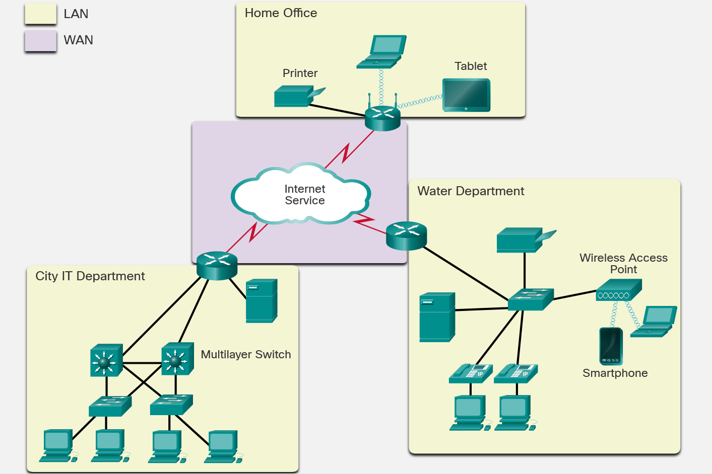

<!-- 1.2.1  -->
## Сети связывают весь мир

Тридцать миллиардов вещей генерируют триллионы гигабайт данных. Как они могут работать сообща, чтобы улучшить принимаемые нами решения и улучшить нашу жизнь и ведение бизнеса? Всё это делают сети, которыми мы пользуемся ежедневно. Эти сети обеспечивают основу для Интернета и оцифрованного мира.

Методы, которые мы используем для общения, продолжают развиваться. Пусть когда-то мы были ограничены кабелями и разъемами, прорывы в беспроводных и цифровых технологиях значительно расширили охват наших средств общения.

Сети составляют основу оцифрованного мира. Сети бывают любых размеров. Они могут варьироваться от простых сетей, состоящих из двух компьютеров, до сетей, соединяющих миллионы устройств.

Простые домашние сети обеспечивают подключение к Интернету. Они также позволяют совместно использовать ресурсы, такие как принтеры, документы, изображения и музыкальные файлы, между несколькими локальными компьютерами.

В компаниях и крупных организациях сети могут предоставлять продукты и услуги клиентам через подключение к Интернету. Сети также могут использоваться в более широком масштабе для обеспечения консолидации, хранения и доступа к информации на сетевых серверах. Сети позволяют работать с электронной почтой, обмениваться мгновенными сообщениями и обеспечивают совместную работу сотрудников. Кроме того, сеть позволяет проводить соединения к новым местам, что повышает ценность машин в промышленных средах.

Интернет является крупнейшей сетью, действующей в настоящее время, и фактически предоставляет "электронную кожу", которая окружает планету. Фактически, термин "Интернет" означает "сеть сетей". Интернет - это буквально набор взаимосвязанных частных и общественных сетей. К Интернету подключаются предприятия, сети малых офисов и домашние сети.

<!-- 1.2.2 -->
## Типы сетей

Современные сети могут немного запутать. Существует множество типов, которые характеризуются их географическим размером, количеством устройств или сетей, которые они соединяют, и тем, поддерживают ли они мобильные устройства или нет. Сети также могут быть охарактеризованы своей функцией и целью.

### Персональная сеть (PAN)

Персональные сети - это небольшие сети, в которых подключенные беспроводные устройства находятся в пределах личной досягаемости. Подключение смартфона к автомобилю с помощью Bluetooth является примером PAN. Другие беспроводные протоколы, которые могут использоваться в PAN, это Zigbee и Ultra-Wide Band (UWB).

### Локальная вычислительная сеть (LAN)

Сети LAN обычно представляют собой сети, расположенные в небольшой или локальной географической зоне, например дома, в малом бизнесе или отделе в крупной корпорации, как показано на рисунке. Сетевые адаптеры могут подключаться к двум или более устройствам, включая компьютеры, принтеры и беспроводные устройства. Сетевые адаптеры обеспечивают доступ к глобальным сетям (WAN) и Интернету.

<!-- https://dmazqqf7fxgsj.cloudfront.net/netacad-media/graphics/ec0c60c0-5386-11ec-9ec5-21081a76fa6a/assets/images/3b0da69a-2e75-4871-aa57-3af89591e9b9.svg -->

### Глобальная вычислительная сеть (WAN)

Термин "WAN" обычно относится к набору локальных сетей, обеспечивающих межсетевое и интернет-подключение для предприятий и государственных структур.

### Интернет

Интернет - это многоуровневая глобальная сетевая система, соединяющая сотни миллионов компьютеров. Интернет не принадлежит какому-либо лицу или организации. Эта большая система состоит из множества локальных и глобальных сетей, обслуживающих частные, государственные, деловые, научные и государственные цели. Она позволяет обмениваться данными между более чем ста странами, подключенными к Интернету, во всем мире. Это делает Интернет огромным носителем различных информационных ресурсов и услуг. В их числе текстовые и мультимедийные данные, электронная почта, интерактивный чат, VoIP, передача файлов и совместный доступ к файлам, электронная коммерция и онлайн-игры.

### Беспроводные сети

Беспроводные сети - это компьютерные сети, которые используют электромагнитные волны вместо проводов для передачи сигналов по различным частям сети. Беспроводные сети могут быть описаны как PAN, LAN или WAN, в зависимости от их масштабов. Поскольку просмотр Интернета считается обычным ежедневным занятием, точки беспроводного доступа стали обычным явлением в современной инфраструктуре связи. Среди общественных мест, подключенных к Интернету, находятся библиотеки, аэропорты, кафе, гостиницы и специализированные интернет-кафе. Благодаря технологии Wi-Fi доступ в Интернет теперь возможен для каждого человека с ноутбуком, планшетом или смартфоном. В таблице показаны различные категории доступных беспроводных сетей.

**Беспроводные сети**

|Тип|Диапазон|Стандарты|
|--|--|--|
|Персональная сеть (PAN)|В пределах досягаемости лица|Bluetooth, ZigBee, NFC|
|Локальная вычислительная сеть (LAN)|В пределах здания или комплекса зданий|IEEE 802.11 (WiFi)|
|Городская вычислительная сеть (MAN)|В пределах города|IEEE 802.15 (WiMAX)|
|Глобальная вычислительная сеть (WAN)|По всему миру|Сотовая сеть (UMTS, LTE и т.д.)|

### Облако

Термин «облако» используется по-разному. Облако — это не столько тип сети, сколько набор центров обработки данных или групп связанных друг с другом серверов, которые используются для хранения и анализа данных, предоставления доступа к онлайн-приложениям и предоставления услуг резервного копирования для личного и корпоративного использования. Облачные услуги предоставляются разными организациями.

### Граница

Граница (или периферия) обозначает пространство между сетью организации и Интернетом. Она определяет место, в котором сеть, управляемая одной организацией, подключается к сети, управляемой другой организацией. Типичным примером является точка, в которой корпоративная сеть подключается к Интернету. В зависимости от размера организации и расположения ее объектов её сеть может иметь больше одной границы.

<!-- 1.2.5  -->
## Определение IP-адресов конечных устройств

Вы только что узнали о сетевых подключениях и о многих типах сетей. Теперь можно создать собственную смоделированную сеть в Cisco Packet Tracer. Просмотрите видео, прежде чем попробовать Packet Tracer.

Дополнительные сведения о Packet Tracer см. в разделе Getting Started with Cisco Packet Tracer course на Skills For All по адресу https://skillsforall.com/topics/cisco-packet-tracer.

<!-- ссылка на видео 1.2.5 -->

<!-- 1.2.6  -->

## Типы подключения устройств

<!-- ссылка на видео 1.2.6 -->
