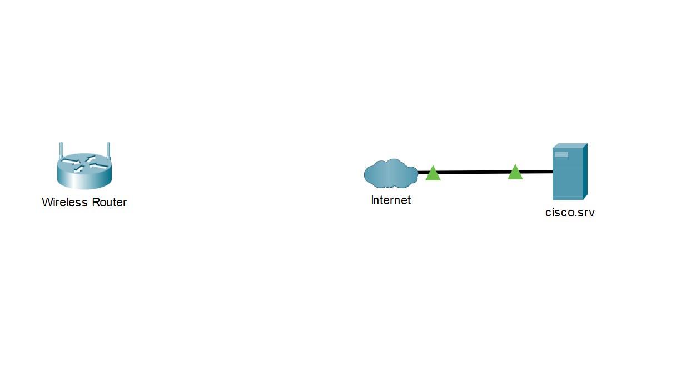

## Топология

## Задачи

В этом задании Вы создадите простую сеть в Packet Tracer в Logical Workspace (логическая рабочая область).

Часть 1: Создание простой сети

Часть 2: Настройка конечных устройств и проверка возможности подключения

## Инструкции

### Часть 1: Создание простой сети

В этой части Вы создадите простую сеть, развертывая и подключая сетевые устройства в Logical Workspace.

### Шаг 1. Добавить сетевые устройства в рабочую область.

На этом шаге Вы добавите ПК, ноутбук и кабельный модем в Logical Workspace.

Кабельный модем - это аппаратное устройство, обеспечивающее связь с Интернет-провайдером (ISP). Коаксиальный кабель от Интернет-провайдера подключен к кабельному модему, а также подключен Ethernet-кабель из локальной сети. Кабельный модем преобразует коаксиальное соединение в Ethernet-соединение.

С помощью поля выбора Device-Type (Тип устройства) добавьте в рабочую область следующие устройства. Категория и подкатегория, связанные с устройством, перечислены ниже:

•	ПК: End Devices > End Devices > PC

•	Ноутбук: End Devices > End Devices > Laptop

•	Кабельный модем: Network Devices > WAN Emulation > Cable Modem

### Шаг 2. Изменить отображаемых имен сетевых устройств.

1. Чтобы изменить отображаемые имена сетевых устройств, щелкните по значку устройства в Logical Workspace

2. Щелкните вкладку **Config** (Конфигурация) в окне конфигурации устройства.

3. Введите новое имя вновь добавленного устройства в поле **Display Name** (Отображаемое имя) : ПК, ноутбук и кабельный модем.

### Шаг 3. Добавить физическую кабельную разводку между устройствами в рабочей области.

С помощью поля выбора Device-Type добавьте физическую кабельную разводку между устройствами в рабочей области.

1. Для подключения к беспроводному маршрутизатору ПК потребуется медный прямой кабель. С помощью поля выбора Device-Type выберите **Connections** (Подключения) (значок молнии). Выберите медный прямой кабель в поле выбора Device-Specific и подключите его к интерфейсу ПК **FastEthernet 0** и интерфейсу беспроводного маршрутизатора **GigabitEthernet 1**.

2. Беспроводному маршрутизатору потребуется медный перекрестный кабель для подключения к кабельному модему. Выберите медный перекрестный кабель в поле выбора Device-Specific и подключите его к интернет интерфейсу беспроводного маршрутизатора и интерфейсу **Port 1** кабельного модема.

3. Для подключения кабельного модема к Интернету потребуется коаксиальный кабель. Выберите коаксиальный кабель в поле выбора Device-Specific и подключите его к интерфейсу кабельного модема **Port 0** и интерфейсу облака **Coaxial 7**.

### Часть 2: Настройка конечных устройств и проверка возможности подключения.

В этой части вы подключите ПК и ноутбук к беспроводному маршрутизатору. ПК будет подключен к сети с помощью кабеля Ethernet. Для ноутбука необходимо заменить проводную сетевую плату Ethernet (NIC) на беспроводную сетевую плату и подключить ноутбук к маршрутизатору беспроводным способом.

После подключения обоих конечных устройств к сети будет проверено подключение к cisco.srv. Каждому ПК и ноутбуку будет назначен IP-адрес (Internet Protocol). Internet Protocol - это набор правил маршрутизации и адресации данных в Интернете. IP-адреса используются для идентификации устройств в сети и для разрешения устройствам подключаться и передавать данные в сети.

### Шаг 1. Настроить ПК.

На этом шаге будет выполнена настройка ПК для проводной сети.

1. Щелкните на **PC**. На вкладке **Desktop** (Рабочий стол) перейдите к **IP Configuration** (Настройка IP), чтобы убедиться, что DHCP включен и ПК получил IP-адрес.

Выберите **DHCP** в поле IP Configuration, если IP-адрес для поля IPv4 Address не отображается. По завершении закройте окно IP Configuration. Наблюдайте за тем, как ПК получает IP-адрес от DHCP-сервера.

DHCP означает протокол динамической конфигурации хоста. Этот протокол динамически назначает IP-адреса устройствам. В данной простой сети беспроводной маршрутизатор настроен для назначения IP-адресов устройствам, запрашивающим IP-адреса. Если протокол DHCP отключен, необходимо назначить IP-адрес и настроить всю необходимую информацию для связи с другими устройствами в сети и Интернете.

2. Закрыть окно **IP Configuration**. На вкладке **Desktop** выберите **Command Prompt** (Командная строка).

3. В командной строке введите **ipconfig /all**, чтобы просмотреть сведения об IPv4-адресе с DHCP-сервера. Компьютер должен был получить IPv4-адрес в диапазоне 192.168.0.x.

**Примечание**: Существует два типа IP-адресов: IPv4 и IPv6. IPv4-адрес (протокол Интернета 4-ой версии) представляет собой строку чисел в виде x.x.x.x, такую же, которую вы использовали в этом задании. По мере роста Интернета потребность в большем количестве IP-адресов стала необходимой. Таким образом, IPv6 (протокол Интернета 6-ой версии) был введен в конце 1990-х годов для решения проблем, связанных с ограничениями IPv4. Подробности IPv6-адресации выходят за рамки этого задания.

4. Проверьте подключение к cisco.srv с компьютера. В командной строке введите команду **ping cisco.srv**. Для возврата эхо-запроса может потребоваться несколько секунд. Вы должны получить четыре ответа.

### Шаг 2. Настроить ноутбук.

На этом шаге вы будете настраивать ноутбук для доступа к беспроводной сети.

1. Щелкните на **Laptop** (Ноутбук) и выберите вкладку **Physical**.

2. На вкладке **Physical** необходимо удалить медный модуль Ethernet и заменить его беспроводным модулем WPC300N.

    1) Выключите ноутбук, нажав кнопку питания сбоку ноутбука.

    2) Удалите только что установленный медный модуль Ethernet, щелкнув на модуль сбоку ноутбука и перетащив его на панель **MODULES** (Модули) слева от окна ноутбука.

    3) Установите модуль беспроводной связи WPC300N, щелкнув на него на панели **MODULES** и перетащив его на пустой порт модуля сбоку ноутбука.

    4) Включите ноутбук, снова нажав кнопку питания ноутбука.

3. После установки модуля беспроводной связи подключите ноутбук к беспроводной сети. Щелкните вкладку **Desktop** и выберите **PC Wireless**. 

4. Выберите вкладку **Connect** (Подключение). После небольшой задержки беспроводная сеть **HomeNetwork** будет видна в списке беспроводных сетей. Нажмите кнопку **Refresh** (Обновить), если необходимо просмотреть список доступных сетей. Выберите **HomeNetwork**. Нажмите кнопку **Connect**.

5. Закройте окно **PC Wireless**. На вкладке **Desktop** выберите **Web Browser**.

6. В веб-браузере перейдите по адресу **cisco.srv**.

### Размышления

Теперь, когда проверено подключение к cisco.srv, используйте команду **ipconfig** из командной строки, чтобы заполнить таблицу IP-адресов ниже:

| Устройство | IPv4-адрес | Маска подсети | Шлюз по умолчанию |
|------------|------------|---------------|-------------------|
| ПК         |            |               |                   |
| Ноутбук    |            |               |                   |

Например:

| Устройство | IPv4-адрес | Маска подсети | Шлюз по умолчанию |
|------------|------------|---------------|-------------------|
| ПК         | 192.168.0.2 | 255.255.255.0 | 192.168.0.1 |
| Ноутбук    | 192.168.0.3 | 255.255.255.0 | 192.168.0.1 |

IP-адреса конечных устройств могут находиться в диапазоне от 192.168.0.2 до 192.168.0.254. Каждая сетевая плата получит уникальный IP-адрес в одной сети.

Маска подсети позволяет выделить из IP-адреса идентификатор сети и идентификатор узла (хоста). IP-адрес можно сравнить с Вашим уличным адресом. Маска подсети определяет длину имени улицы. Сетевой частью адреса является ваша улица, 192.168.0. Номер дома - это порт хоста IP-адреса. Для IP-адреса 192.168.0.2 номер дома - 2, а улица - 192.168.0. Если на одной улице имеется более одного дома, например, дом номер 3, будет иметь адрес 192.168.0.3. Максимальное количество домов на этой улице составляет 253, от 2 до 254.

Шлюз по умолчанию аналогичен дорожному перекрёстку. Автомобили с улицы 192.168.0 должны проехать через перекресток на другую улицу. Другая улица - это другая сеть. В этой сети шлюзом по умолчанию является беспроводной маршрутизатор, который направляет трафик из локальной сети на кабельный модем, а затем трафик отправляется интернет-провайдеру. 

[Скачать файл Packet Tracer для локального запуска](./assets/1.2.7-packet-tracer-create-a-simple-network.pka)

