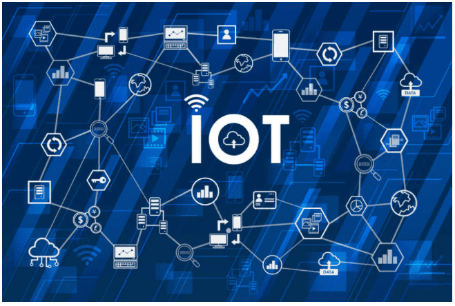
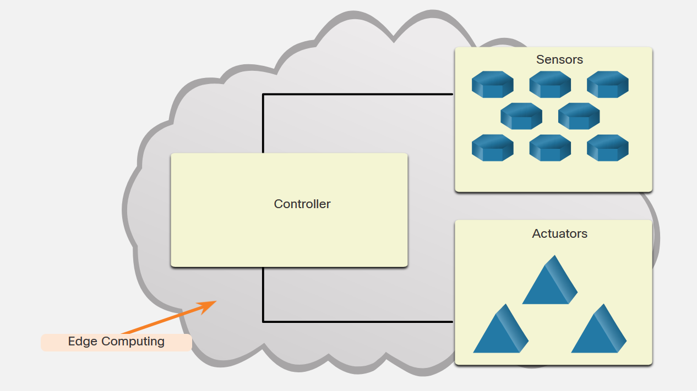

<!-- 1.3.1  -->
## Что такое интернет вещей?

Интернет вещей (IoT) — это соединение миллионов умных устройств и датчиков, подключенных к Интернету. Эти связанные друг с другом устройства и датчики собирают и обмениваются данными для использования и оценки многими организациями. Эти организации включают предприятия, города, государственные структуры, больницы и частных лиц. Интернет вещей стал возможен отчасти благодаря появлению дешевых процессоров и беспроводных сетей. Ранее неодушевленные предметы, такие как дверные ручки или лампочки, теперь могут быть оснащены интеллектуальным датчиком, который может собирать и передавать данные в сеть.

По оценкам исследователей, в 2025 году к Интернету будет подключено 38,6 миллиарда IoT-устройств, а к 2030 году — 50 миллиардов. Это 190 миллионов новых подключенных устройств каждый месяц!

Возможно, треть подключенных устройств составят компьютеры, смартфоны, планшеты и смарт-телевизоры. Оставшиеся две трети будут другими видами «вещей»: датчиками, исполнительными механизмами и недавно изобретенными интеллектуальными устройствами, которые мониторят, контролируют, анализируют и оптимизируют наш мир.

Вот некоторые примеры интеллектуальных подключенных датчиков: умные дверные звонки, гаражные ворота, термостаты, спортивные носимые устройства, кардиостимуляторы, светофоры, парковочные места и многие другие. Предел различных объектов, которые могли бы стать интеллектуальными датчиками, ограничивается только нашим воображением.

<!-- 1.3.3 -->
## Каковы преимущества подключения этих устройств?

Многие различные организации извлекают выгоду из данных, которые были собранны, сохраненны и проанализированны датчиками.

Предприятия имеют больше информации о продаваемых ими продуктах и о том, кто их покупает. Обладая такими данными, они могут оптимизировать производство и ориентировать свои маркетинговые и рекламные мероприятия на конкретные области или аудитории, способствовать созданию новых возможностей для бизнеса и маркетинговых идей.

Розничные компании могут осуществлять больше целевых маркетинговых мероприятий, сокращать потери, связанные с непроданными товарами, и предоставлять бонусы лояльности привилегированным или постоянным клиентам, а также управлять типами товаров в магазинах.

Промышленность экономит деньги, повышает эффективность и повышает производительность производственных процессов и операций. Производители снижают время простоя, прогнозируя потребности в обслуживании и улучшая планирование сотрудников, работающих на местах.

Государственные структуры контролируют экологические вопросы, целевое финансирование для решения социальных вопросов и осуществляют информированный контроль за выработкой электроэнергии.

Города имеют возможность контролировать движение транспорта в зависимости от времени суток или крупных событий, отслеживать и контролировать мусор и его переработку, следить за потребностями в здравоохранении и жилье, а также оценивать будущие потребности в транспорте.

Люди могут получить улучшенную физическую форму и здоровье, повысить безопасность дома и семьи, а также снизить затраты на электроэнергию и системы отопления. Они могут наслаждаться более разнообразными развлечениями, ограничивать скорость, которую может развить водитель-подросток, или даже следить за здоровьем старшего члена семьи за рулем своего автомобиля.

<!-- 1.3.5  -->
## Как IoT-устройства подключены к сети?

Датчик должен быть подключен к сети, чтобы собранные данные можно было хранить и совместно использовать. Для этого требуется проводное подключение Ethernet или беспроводное подключение к контроллеру. В то время как может использоваться беспроводная сеть Ethernet, более практичны альтернативные варианты с низким энергопотреблением, такие как Bluetooth LE, Zigbee или LoRa. Контроллеры отвечают за сбор данных с датчиков и обеспечение сетевого или интернет-соединения. Контроллеры могут принимать немедленные решения или отправлять данные на более мощный компьютер для анализа. Этот более мощный компьютер может находиться в той же локальной сети, что и контроллер, или быть доступен только через подключение к Интернету.

Датчики часто работают вместе с устройством, которое называется исполнительный элемент (или исполнительное устройство). Исполнительный элемент превращает входной электрический сигнал в физический импульс. Например, если датчик обнаруживает избыточное количество тепла в помещении, датчик передает показания температуры микроконтроллеру. Микроконтроллер может передавать данные на исполнительный элемент, который затем включает кондиционер.

Большинство новых устройств, таких как фитнес браслеты, имплантированные кардиостимуляторы, воздухомеры в шахте, а также водяные счётчики на фермах - все это требует беспроводной связи. Поскольку многие датчики находятся «в поле» и питаются от батарей или солнечных панелей, необходимо учитывать энергопотребление. Для оптимизации и расширения доступности датчика необходимо использовать варианты подключения с низким энергопотреблением.

## Пример IoT-топологии 

<!-- https://dmazqqf7fxgsj.cloudfront.net/netacad-media/graphics/03c74330-5312-11ec-ace4-73465f789de7/assets/images/0dd1373f-bbf7-4985-9e00-41fc4347abd9.svg -->