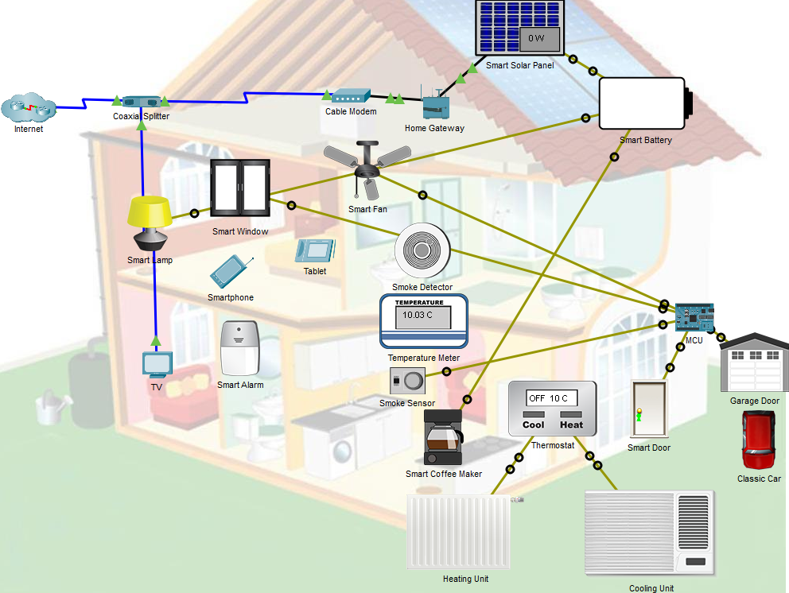

## Топология

## Задачи

Часть 1: Изучить существующую сеть Smart Home

Часть 2: Добавить беспроводные IoT-устройства в сеть Smart Home Network

Часть 3: Добавить проводные IoT-устройства в сеть Smart Home Network

## Общие сведения и сценарий

В этом упражнении Вы откроете файл Packet Tracer с существующей домашней сетью, изучите устройства в сети, а затем добавите дополнительные проводные и беспроводные IoT-устройства.

## Инструкции

### Часть 1: Изучить существующую сеть Smart Home

### Шаг 1. Изучите доступные конечные IoT-устройства.

1. В левом нижнем углу окна Packet Tracer найдите и щелкните значок **End Devices** (Ctrl + Alt + V) в верхней строке, а в нижней - значок **Home** (Ctrl + Alt + H).

2. В поле выбора **Device-Specific** (Конкретное устройство) отображаются различные доступные IoT-устройства для сети Smart Home.

Наведите указатель мыши на каждое устройство и заметьте, что описательное имя устройства отображается в нижней части поля выбора Device-Specific. Рассмотрите устройства каждого типа.

### Шаг 2. Изучить сеть Smart Home.

1. В рабочей области **Logical** (Логическая рабочая область) находится предварительно созданная умная домашняя сеть, состоящая из множества проводных и беспроводных IoT-устройств и устройств сетевой инфраструктуры.

    Если навести курсор на устройство, например, **Smart Fan** (умный вентилятор), откроется информационное окно, содержащее базовую сетевую информацию об этом устройстве.

2. Чтобы включить или активировать устройство, удерживайте нажатой клавишу **Alt**, а затем щелкните устройство, которое необходимо проверить. Попробуйте это на каждом из умных устройств, чтобы посмотреть, что они делают.

3. Щелкните на **Home Gateway** (домашний шлюз). Вкладка **Physical** (Физическая) выбрана по умолчанию и отображает изображение домашнего шлюза.

4. Перейдите на вкладку **Config** (Конфигурация), а затем на левой панели щелкните **LAN**, чтобы просмотреть настройки LAN на домашнем шлюзе.

    Запишите IP-адрес домашней сети для дальнейшего использования.

5. Нажмите на **Wireless** (Беспроводной) на левой панели. При необходимости разверните окно.

    Запишите SSID домашней сети.

    Запишите пароль-фразу для WPA2-PSK.

6.  Нажмите на устройство **Tablet** (Планшет), а затем выберите вкладку **Desktop** > **Web Browser**.

7. В поле **URL** введите IP-адрес, записанный для домашнего шлюза, и нажмите кнопку **Go**. 

8. Введите **admin** для имени пользователя и пароля, а затем нажмите **Submit**.

9.  Появится список всех подключенных IoT-устройств. Щелкните по устройству в списке, чтобы просмотреть его состояние и параметры. Попытайтесь повзаимодействовать с некоторыми устройствами, чтобы понять, как можно управлять их состояниями с помощью **Tablet**. Например, откройте и закройте **Garage Door** (Дверь гаража), включите и выключите **Smart Lamp** (Умная лампа) и т.д.

### Часть 2: Добавить беспроводные IoT-устройствf в сеть Smart Home

### Шаг 1. Добавьте беспроводное устройство в сеть.

1. В поле выбора **Device-Specific** щелкните по значку **Wind Detector** (Детектор ветра), а затем щелкните по рабочей области, там где хотите его разместить. (Нажмите **End Devices** > **Home** > **Wind Detector** )

2. Чтобы настроить **Wind Detector**, щелкните по нему и перейдите на вкладку **Config**.

3. Измените отображаемое имя на Wind Detector.

    **Примечание**: Используйте имя, которое указано в инструкциях.

4. В нижней панели измените **IoT server** на "Home Gateway".

5. Нажмите на **Wireless0** на левой панели. Измените тип аутентификации на **WPA2-PSK**, а в поле **PSK Pass Phrase** введите пароль-фразу, записанную в предыдущей части.

    Через несколько секунд между **Wind Detector** и **Home Gateway** должно быть установлено беспроводное соединение. Окно **Wind Detector** можно закрыть.

### Шаг 2. Убедитесь, что **Wind Detector** подключен к сети.

1. Нажмите на **Tablet**.

2. При необходимости войдите снова в **Home Gateway**.

3. Устройство **Wind Detector** теперь должно находиться в нижней части списка **IoT Server – Devices**.

### Часть 3: Добавить проводные IoT-устройства в сеть Smart Home

### Шаг 1. Подключите устройство к сети по проводу.

1. В поле выбора **Device-Specific** выберите **Lawn Sprinkler** (Машина для поливки газонов) ( **End Devices** > **Home** > **Lawn Sprinkler** ), а затем щелкните по рабочей области, там где хотите разместить его.

2. Нажмите на **Lawn Sprinkler** затем выберите **Advanced** (Дополнительно) в правом нижнем углу. Станут доступны дополнительные вкладки.

3. Перейдите на вкладку **I/O Config**.

4. В раскрывающемся меню для сетевого адаптера измените его на **PT-IOT-NM-1CFE** для подключения по стандарту FastEthernet.

5. Проложите кабель от **Lawn Sprinkler** к **Home Gateway**.

    В поле выбора **Device-Type** нажмите на значок **Connections** (Подключения) (он выглядит как молния). В поле выбора **Device-Specific**, нажмите на значок **Copper Straight Through** (Прямой медный провод), а затем нажмите на значок **Lawn Sprinkler** и подключите его к интерфейсу **FastEthernet0**. Затем нажмите на значок **Home Gateway** и подключите другой конец кабеля к доступному **Ethernet** интерфейсу. 

### Шаг 2. Настройте **Lawn Sprinkler** для подключения к сети.

1. В окне **Lawn Sprinkler** щелкните вкладку **Config**, чтобы изменить параметры конфигурации устройства.

2. Измените отображаемое имя на Smart Sprinkler.

3. Установите **IoT Server** в значение **Home Gateway**.

4. В левой панели нажмите на **FastEthernet0**, а затем для параметра **IP Configuration** выберите **DHCP**.

### Шаг 3. Убедитесь, что **Lawn Sprinkler** подключен к сети.

1. Нажмите на **Tablet*.

2. При необходимости войдите снова в **Home Gateway**.

3. Устройство **Smart Sprinkler** теперь должно находиться в нижней части списка **IoT Server – Devices**.

    **Примечание**: Для появления **Smart Sprinkler** в списке может потребоваться несколько секунд.

### Шаг 4. Добавьте Water Level Monitor.

1. В поле выбора **Device-Specific** выберите **Water Level Monitor** (монитор уровня воды) ( **End Devices** > **Home** > **Water Level Monitor** ), а затем щелкните по рабочей области, там где хотите разместить его.

    В поле "Выбор для конкретного устройства" выберите "Монитор уровня воды" ("Конечные устройства" > "Главная" > "Монитор уровня воды"), а затем щелкните в рабочей области, в которую необходимо разместить монитор.

2. Нажмите на**Water Level Monitor**, а затем выберите **Advanced**. чтобы отобразить дополнительные вкладки.

3. Перейдите на вкладку **Config** и измените отображаемое имя на Water Meter.

4. Установите **IoT server** в значение **Home Gateway**.

5. Нажмите на **Wireless0** и убедитесь, что **Water Meter** использует **Home Gateway** в качестве SSID.

6. Настройте парольную фразу для беспроводной сети.

7. Убедитесь, что **Water Meter** настроен на получение IP-адреса от DHCP-сервера на **Home Gateway**.

8. Перейдите на вкладку **I/O Config**, а затем укажите число 1 в поле **Digital Slots** (цифровые слоты).

9. Для параметра **Usage** (использование) укажите значение **Component** (компонент).

10. Подключите **Water Meter** к **Smart Sprinkler**.

    Выберите **Connections** (Подключения) в поле выбора **Device-Type**, а затем в поле выбора **Device-Specific** нажмите на **IoT Custom Cable** (Настраиваемый IoT-кабель). Нажмите на **Smart Sprinkler** и подключите один конец кабеля к интерфейсу **D0**. Нажмите на **Water Meter** и подключите кабель к интерфейсу **D0**.

### Шаг 5. Убедитесь, что Water Meter подключен к сети.

1. Нажмите на **Smartphone**, а затем на вкладку **Desktop** > **Web Browser**.

2. Войдите в **Home Gateway**.

3. Устройство **Water Meter** теперь должно находиться в нижней части списка **IoT Server – Devices**.

### Шаг 6. Добавьте другие IoT-устройства.

Экспериментируйте, добавляя другие типы IoT-устройств в беспроводную сеть умного дома.

[Скачать файл Packet Tracer для локального запуска](./assets/add-iot-devices-in-pt.pka)