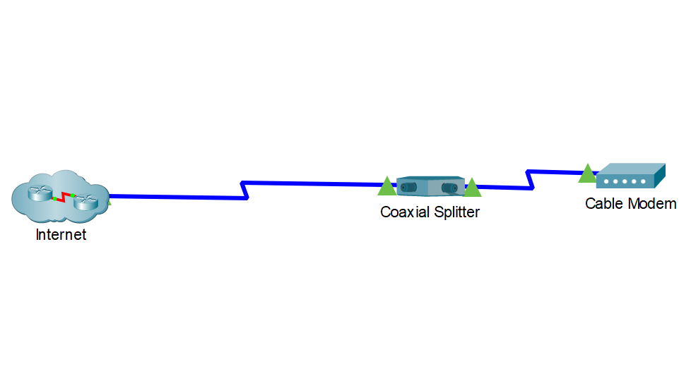

---

> **ВАЖНО**
> 
> Форма для ответов на вопросы будет доступна только при развертывании лабораторной работы 

---

## Топология

## Задачи

Часть 1: Подключить домашний шлюз к сети

Часть 2: Добавить устройства конечных пользователей в сеть

Часть 3: Подключить IoT-устройства к сети

Часть 4: Добавить Bluetooth устройства

## Общие сведения и сценарий

В этом задании Вы добавите домашний шлюз и несколько IoT-устройств в существующую домашнюю сеть и отследите эти устройства через домашний шлюз.

**Примечание**: Используйте только указанные в инструкциях отображаемые имена (**Display Name**) для устройств.

## Инструкции

### Часть 1: Подключить домашний шлюз к сети

### Шаг 1. Добавить домашний шлюз.

1. В поле выбора **Device-Type** выберите **Network Devices** (Сетевые устройства), а затем **Wireless Devices** (Беспроводные устройства).

2. Нажмите на **Home Gateway** (Домашний шлюз), а затем щелкните по рабочей области **Logical**, чтобы разместить устройство.

3. Нажмите на **Home Gateway0**, а затем на вкладку **Config** (Конфигурация). Измените **Display name** (Отображаемое имя) на Home Gateway.

### Шаг 2. Подключить домашний шлюз к кабельному модему.

1. В поле выбора **Device-Type** выберите **Connections** (Подключения), а затем **Copper Straight-Through cable** (Прямой медный кабель).

2. Нажмите на **Cable modem** (Кабельный модем) и подключите один конец кабеля к **Port 1**.

3. Нажмите на **Home Gateway** и подключите другой конец кабеля к порту **Internet**.

### Часть 2: Добавить устройства конечных пользователей в сеть

### Шаг 1. Добавить беспроводной планшет в рабочую область.

1. В поле выбора **Device-Type** нажмите на **End Devices** (Конечные устройства), а затем на **Tablet** (Планшет). Добавьте **Tablet** в рабочую область.

2. Нажмите на **Tablet PC0**, а затем на вкладку **Config**. Измените **Display Name** на Tablet.

### Шаг 2. Подключить планшет к сети домашнего шлюза.

Обратите внимание, что планшет уже подключен к сотовой сети. Синий сигнал беспроводной связи подключен к Интернет облаку, где находится провайдер мобильной связи.

1. Чтобы подключить **Tablet** к домашней беспроводной сети, нажмите на **Wireless0** на левой панели на вкладке **Config**. 

2. Измените SSID с **Default** на **HomeGateway**. Планшет подключится к домашней сети Wi-Fi. Изменение IP-адресации на адрес из сети 192.168.25.x может занять одну или две минуты. Чтобы ускорить процесс, можно нажать на ** Fast Forward Time** (Быстрая перемотка времени) (Alt+D).

3. Обратите внимание, что планшет имеет два беспроводных подключения: сотовое соединение и Wi-Fi. Это часто используется для планшетов и смартфонов с поддержкой сотовой связи.

### Шаг 3. Получить доступ к домашнему шлюзу с планшета.

Из планшета нажмите на вкладку **Desktop tab** > **IoT Monitor**. Обратите внимание, что IP-адрес IoT-сервера - это IP-адрес домашнего шлюза, а для имени пользователя и пароля используется **admin**. Нажмите на **Login** (Вход).

Примечание: Это позволяет проверить, доступен ли IoT-сервер для домашнего шлюза. Обратите внимание, что в списке **Home Gateway IoT Server – Devices** пока нет устройств.

## Часть 3: Подключить IoT-устройств к сети

В этой части Вы добавите в сеть три новых IoT-устройства и зарегистрируете их на сервере домашнего шлюза.

### Шаг 1. Добавьте IoT-устройство в проводную сеть.

На этом шаге Вы подключите новое IoT-устройство к проводной сети.

1. В поле выбора **Device-Type** выберите **End Devices** (Конечные устройства) > **Home** (Дом), затем нажмите на **Lamp** (Лампа) и добавьте её в рабочую область.

2. Нажмите на устройство **Lamp**, а затем **Advanced**, чтобы открыть дополнительные вкладки.

3. Нажмите на **I/O Config**, чтобы изменить **Network Adapter** (Сетевой адаптер) на PT-IOT-NM-1CFE.

4. Нажмите на вкладку **Config** и переименуйте устройство как Lamp.

5. В левой панели нажмите на **FastEthernet0**, затем на **DHCP**, чтобы лампа получила IPv4-адрес от домашнего шлюза.

6. Нажмите на **Connections** > **Copper Straight-Through** и подключите порт **Fastethernet0** лампы к одному из доступных портов Ethernet на домашнем шлюзе.

### Шаг 2. Добавьте IoT-устройства в беспроводную сеть домашнего шлюза.

На этом этапе Вы подключите два новых  IoT-устройства к беспроводной сети.

1. В поле выбора **Device-Type** выберите **End Devices** > **Home**. Добавьте **Fan** (Вентилятор) и **Door* (Дверь) в рабочую область.

2. Измените отображаемое имя вентилятора на Fan.

3. Измените отображаемое имя двери на Door.

4. Обратите внимание, что в конфигурации **Wireless0** для каждого устройства, SSID уже установлен в значение **HomeGateway** и что каждое устройство получило IP-адрес из сети 192.168.25.x. Для ускорения процесса может потребоваться нажать на **Fast Forward Time**.

### Шаг 3. Настройте  IoT-устройства для регистрации на сервере домашнего шлюза.

Для каждого из трех IoT-устройств выберите вкладку **Config**, затем **Settings** на левой панели, если необходимо. Прокрутите вниз список параметров для **IoT Server** и нажмите на **Home Gateway**.

### Шаг 4. Убедиться, что устройства зарегистрированы на сервере домашнего шлюза.

Из планшета выберите вкладку **Desktop tab** > **IoT Monitor**, затем нажмите **Вход**. Вы увидите записи для всех трех новых IoT-устройств. Также Вы можете просмотреть сведения об устройствах. Попробуйте поуправлять устройствами и посмотрите как это отражается в рабочей области.

**Примечание**: Регистрация этих трех устройств на сервере может занять одну или две минуты и их список можно найти в **IoT Monitor**.

## Часть 4: Добавить Bluetooth устройства 

В этой части Вы добавите Bluetooth динамик в беспроводную сеть. Вы подключите портативный музыкальный проигрыватель к динамику.

### Шаг 1. Добавить динамик Bluetooth в беспроводную сеть.

1. В поле выбора **Device-Type** выберите **End Devices** > **Home**. Добавьте устройство **Bluetooth Speaker** в рабочую область.

2. Обратите внимание, что динамик автоматически подключен к домашнему шлюзу. Через несколько минут динамик будет настроен с IP-адресом из сети 192.168.25.x.

3. Измените отображаемое имя динамика на Speaker.

4. На вкладке **Config** для динамика нажмите на **Bluetooth** на левой панели, а затем переключите **Port Status** (Состояние порта) в положение **On** (Включен).

### Шаг 2. Добавить портативный медиа-плеер в беспроводную сеть

1. В поле выбора **Device-Type** выберите **End Devices** > **Home**. Добавьте **Portable Music Player** в рабочую область.

2. Обратите внимание, что музыкальный проигрыватель автоматически подключен к домашнему шлюзу. Через несколько минут он будет настроен с IP-адресом из сети 192.168.25.x.

3. Измените отображаемое имя на **Music Player**.

### Шаг 3. Подключите музыкальный проигрыватель к динамику.

1. Переключить **Port Status** Bluetooth в положение **On**.

2. Нажмите **Discover** (Обнаружить) в **Discoverable Devices**, затем **Speaker**, затем **Pair** (Подключить) и **Yes**.

3. Удерживая нажатой клавишу Alt, нажмите на **Music Player**. (Подсказка: Убедитесь, что динамики для Вашего реального компьютера включены.)

* ответьте на вопрос №1

### Шаг 4. Изучите сеть.

Не стесняйтесь добавлять в сеть больше проводных и беспроводных устройств. Для IoT-устройств удерживайте нажатой клавишу Alt и нажимайте на устройства, чтобы взаимодействовать с ними. Удерживая нажатой клавишу Alt, Вы можете включить музыкальный проигрыватель, открыть дверь и включить лампу с вентилятором. Не забывайте, что Вы также можете управлять IoT-устройствами из приложения **IoT Monitor** на смартфоне или планшете.

[Скачать файл Packet Tracer для локального запуска](./assets/1.4.4-packet-tracer-connect-to-a-home-gateway-and-monitor-network.pka)