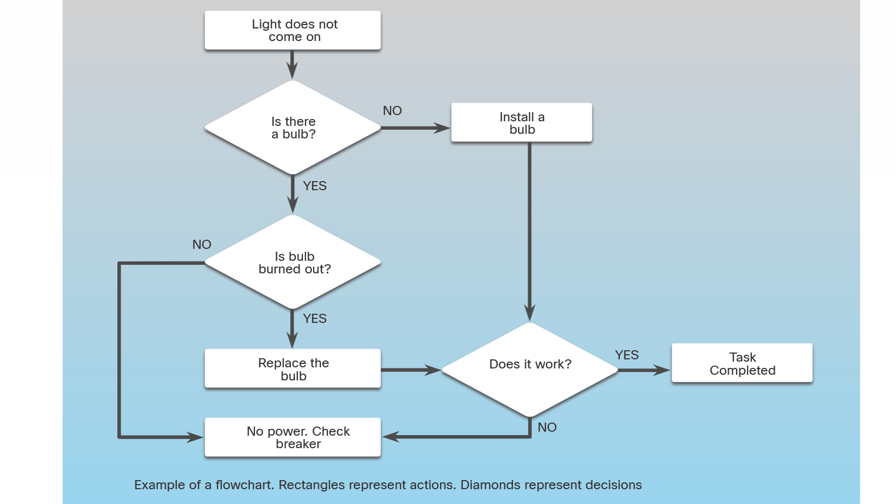

<!-- 2.1.2 --> 
## Блок-схемы

Блок-схемы используются во многих отраслях, включая машиностроение, физические науки и компьютерное программирование, где требуется полное понимание рабочих процессов. Блок-схемы — это диаграммы, которые используются для представления этих рабочих процессов.

Блок-схемы иллюстрируют, как должен работать процесс. Блок-схемы не должны требовать сложной отраслевой терминологии или символов. Блок-схема должна быть простой для понимания, даже если Вы не являетесь экспертом в выбранной области.

Блок-схемы должны отображать входные состояния, любые принятые решения и результаты этих решений. Важно показать шаги, которые должны быть предприняты, когда результат решения либо да, либо нет.

Программисты обычно создают первый набросок программы не используя какой-то определенный язык программирования. Эти независимые от языка программы сосредоточены на логике, а не на синтаксисе, и их часто называют алгоритмами. Блок-схема — это распространенный способ изображения алгоритма. Пример блок-схемы показан на рисунке.


<!-- https://dmazqqf7fxgsj.cloudfront.net/netacad-media/graphics/780cc6b0-5313-11ec-beb5-0f461e2f4947/assets/images/c57e6c11-9b15-4f60-9f7f-d8569dc351a3.svg --> 

<!-- 2.1.3 --> 
## Системное программное обеспечение, прикладное программное обеспечение и компьютерные языки

Существует два распространенных типа компьютерного программного обеспечения: системное программное обеспечение и прикладное программное обеспечение.

Прикладные программы создаются для выполнения определенной задачи или набора задач. Например, Cisco Packet Tracer — это программа моделирования сети, которая позволяет пользователям моделировать сложные сети и задавать вопросы «что, если?» о поведении сети.

Системное программное обеспечение работает между аппаратным обеспечением компьютера и прикладной программой. Это системное программное обеспечение, которое управляет аппаратным обеспечением компьютера и позволяет работать прикладным программам. Популярные примеры системного программного обеспечения включают Linux, Apple OSX и Microsoft Windows.

И системное программное обеспечение, и прикладное программное обеспечение создаются с использованием языка программирования. Язык программирования — это формальный язык, предназначенный для создания программ, которые передают инструкции компьютерному оборудованию. Эти программы реализуют алгоритмы, которые представляют собой автономные пошаговые наборы операций, которые необходимо выполнить.

Некоторые компьютерные языки компилируют свои программы в набор команд в машинном коде. C++ является примером транслируемого, или компилируемого, компьютерного языка. Другие интерпретируют эти инструкции напрямую, без предварительной компиляции их в машинный код. Python — это пример интерпретируемого языка программирования. Пример кода Python показан на рисунке.

Когда язык программирования определен и процесс изображен на блок-схеме, можно начинать создание программы. Большинство языков программирования используют схожие структуры программ.

### Программа для проверки високосных лет в Python

```python
    year = int(input("Enter a year to check if it is a leap year\n"))
    if (year % 4) == 0:
        if (year % 100) == 0:
            if (year % 400) == 0:
                print("{0} is a leap year".format(year))
            else:
                print("{0} is not a leap year".format(year))
        else:
            print("{0} is a leap year".format(year))
    else:
        print("{0} is not a leap year".format(year))
    }
```   

<!-- 2.1.4 -->
## Переменные в программировании 

Языки программирования используют переменные в качестве динамических сегментов для хранения фраз, чисел или другой важной информации, которую можно использовать при написании кода. Вместо того, чтобы повторять определенные значения во многих местах кода, можно использовать переменную. Переменные могут содержать результат вычисления, результат запроса к базе данных или какое-либо другое значение. Это означает, что один и тот же код будет работать с разными фрагментами данных без необходимости его перезаписи.

Например, «x + y = z» является примером выражения в программировании. В этом выражении x, y и z являются переменными, которые могут представлять символы, строки символов, числовые значения или адреса памяти.

Переменная может ссылаться на значение. Например, выражение «а = 10» связывает значение 10 с переменной а.

Переменная также может представлять ячейку памяти. Выражение «а = 10» означает, что значение 10 хранится в каком-то месте памяти компьютера, которое обозначается как «а».

Переменные можно разделить на две категории:

* **Локальные переменные** — это переменные, объявленные внутри программы/функции/процедуры.
* **Глобальные переменные** — это переменные, областью видимости которых является вся программа. Их можно вызвать из любой части программы.

Переменные позволяют программистам быстро создавать широкий спектр простых или сложных программ, которые предписывают компьютеру вести себя заранее определенным образом.

<!-- 2.1.5 --> 
## Базовые структуры программ

Люди передают логику компьютерам через программы. Используя определенные логические структуры, программист может подготовить компьютер к принятию решений. Наиболее распространенными логическими структурами являются:

**IF – THEN** - Эта логическая структура позволяет компьютеру принимать решение на основе результата выражения. Пример выражения: myVar > 0. Это выражение истинно, если значение, хранящееся в переменной myVar, больше нуля. Когда встречается структура IF-THEN, она оценивает предоставленное выражение. Если выражение ложно, компьютер переходит к следующей структуре, игнорируя содержимое блока IF-THEN. Если выражение истинно, компьютер выполняет соответствующее действие, прежде чем перейти к следующей инструкции в программе.

Этот пример кода выводит на экран сообщение «Value1 больше, чем Value2», если выражение value1 > value2 истинно.

````markdown
if (value1 > value2):
    print("Value1 is greater than Value2.")
````

**FOR loops (циклы)** — используются для выполнения определенного набора инструкций определенное количество раз на основе выражения. Термин цикл происходит от того факта, что набор инструкций выполняется многократно. Хотя синтаксис циклов FOR варьируется от языка к языку, концепция остается неизменной. Переменная действует как счетчик внутри диапазона значений, определяемых минимумом и максимумом. Каждый раз, когда цикл выполняется, переменная счетчика увеличивается. Когда счетчик равен заданному максимальному значению, цикл прерывается и выполнение переходит к следующей инструкции.

В этом примере кода выводится «counter = N» (где N — значение переменной счетчика «i».)

````markdown
i=0 
for i in range(0, 100):
    print("counter =",i)
    i = i + 1
````


Сообщение печатается на экране 100 раз.

**WHILE loops**— используются для выполнения определенного набора инструкций, пока выражение истинно. Обратите внимание, что часто инструкции внутри цикла в конечном итоге приводят к тому, что выражение оценивается как ложное.

Этот пример кода выводит на экран «Value is still less than 10» (Значение все еще меньше 10), пока значение < 10. Обратите внимание, что программа также увеличивает значение при каждом выполнении цикла WHILE.

````markdown
while value < 10:
    print("Value is still less than 10")
    value = value + 1
````
