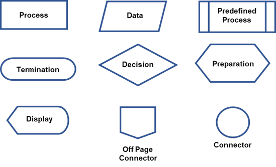
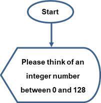
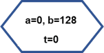
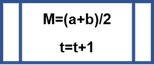
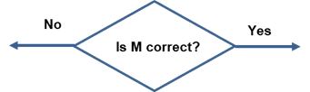
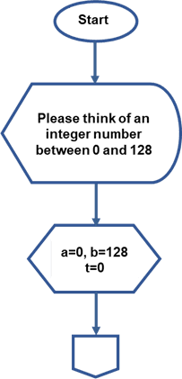
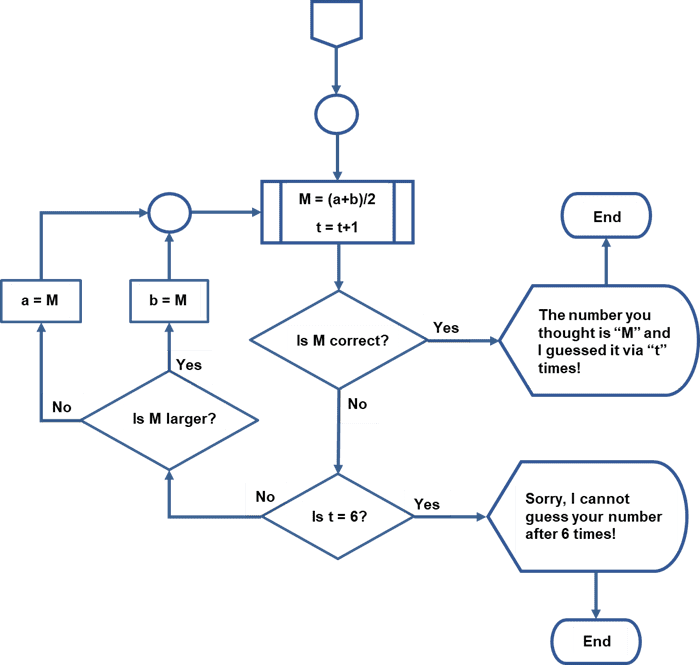

---

> **ВАЖНО**
> 
> Форма для ответов на вопросы будет доступна только при развертывании лабораторной работы 

---

## Задачи

Часть 1. Перечислить логические шаги для решения проблемы

Часть 2: Нарисовать блок-схему

## Общие сведения

Блок-схемы — это диаграммы, используемые для изображения рабочих процессов. Используя различные формы, блоки и соединяющие стрелки, блок-схема представляет поток решения данной проблемы. Блок-схемы обычно используются для представления программ, алгоритмов или любого упорядоченного процесса в различных дисциплинах. Блок-схемы обычно создаются до запуска процесса или написания приложения, чтобы проверить и уловить потенциальные логические потоки, ведущие к решению, прежде чем оно будет разработано и внедрено.

Блок-схемы можно рисовать вручную или создавать с помощью ряда пакетов, включая продукты Microsoft Office, LibreOffice, GoogleDocs и различные веб-приложения, такие как https://www.draw.io/.

Некоторые из наиболее распространенных символов блок-схем, используемых для программирования, показаны на диаграмме вместе с предполагаемой целью символа. Линии со стрелками указывают на ход процесса решения проблемы.



## Сценарий

Вы должны разработать систематический процесс, чтобы найти заданное число. Разработанный процесс представлен на блок-схеме. Используя блок-схему, мы можем проверить и подтвердить логический процесс решения проблемы.

## Требуемые ресурсы

Это задание можно выполнить с бумагой и карандашом, ПК с доступом в Интернет или офисными приложениями, такими как Microsoft Office, LibreOffice и GoogleDocs.

## Инструкции

### Часть 1. Перечислить логические шаги для решения проблемы

Задача состоит в том, чтобы разработать процесс нахождения заданного числа. Процесс можно запрограммировать как простую компьютерную игру. Игрока просят подумать о целом числе от 0 до 128. Программа будет использовать метод деления пополам, чтобы найти число.

1. Попросите игрока подумать о целом числе от 0 до 128.
2. Укажите a в качестве нижнего предела, b в качестве верхнего предела и t в качестве времени расчета.
3. Укажите начальные значения, a = 0, b = 128, t = 0
4. Вычислите среднее число между a и b. Установите его как М.
5. Укажите t = t + 1
6. Спросите игрока, является ли M правильным числом:

````
        If yes, print “The number you thought of is M and I guessed it in t tries.” End the process.
    Else
        If t = 6
            If yes, print “I am sorry that I cannot guess it after 6 attempts.” End the process.
            Else
                Ask the player if M is larger than the correct number:
                    If yes, set a = M, jump to Step d.
                    Else
                        Set b = M, jump to Step d.
````

Вопросы:

* ответьте на вопрос №1
* ответьте на вопрос №2

### Часть 2: Нарисовать блок-схему

### Шаг 1: Использовать соответствующие символы блок-схемы для каждой функции.

Поскольку список шагов процесса определён, мы можем использовать символы блок-схемы для изображения каждого шага.

1. Используйте овальный символ чтобы показать Начало и символ Дисплей, чтобы задать вопросы. Используйте линию, чтобы связать их вместе:



2. Используйте символ Подготовка для первоначального присвоения значений:



3. Используйте символ Предопределенный процесс, чтобы определить функцию процесса или подпрограмму:



4. Используйте символ Решение для изображения проверки состояния:



5. Используйте символ Процесс для изображения операции:


### Шаг 2: Нарисовать полную блок-схему.

Теперь мы можем использовать символы, чтобы нарисовать полную блок-схему. Мы будем использовать Межстраничное соединение и Соединитель, чтобы расширить блок-схему до следующей страницы:



Блок-схему можно продолжить на следующей странице с помощью символов Межстраничное соединение и Соединитель.



## Размышления

Вопросы:

* ответьте на вопрос №3
* ответьте на вопрос №4


