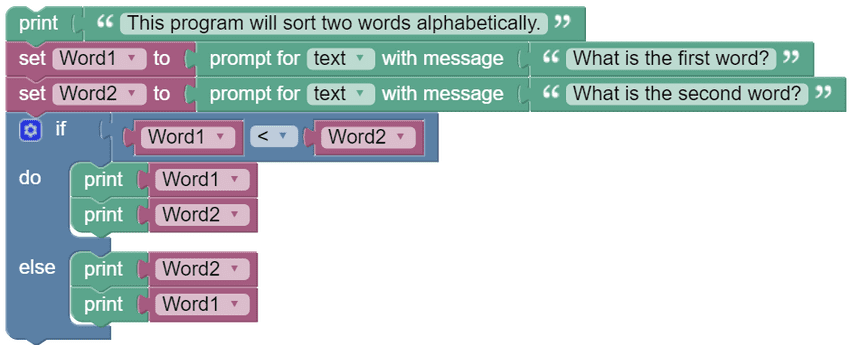
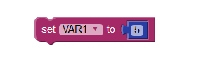
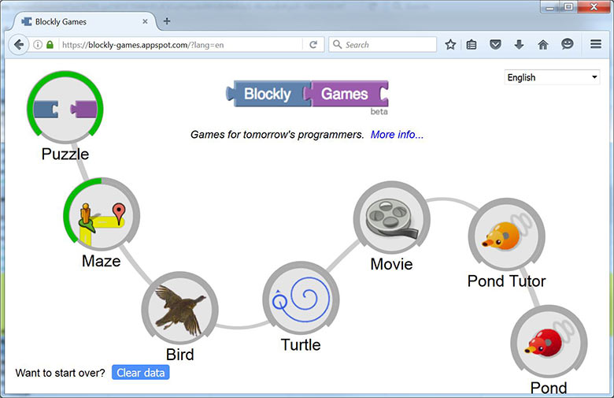

<!-- 2.2.1 -->
## Что такое Blockly?

Blockly — это инструмент визуального программирования, созданный, чтобы помочь новичкам понять концепции программирования. Используя несколько типов блоков, Blockly позволяет пользователю создавать программу без ввода каких-либо строк кода.

Blockly реализует визуальное программирование, закрепляя за цветными блоками различные программные структуры. Блоки также содержат слоты и пробелы, позволяющие программистам вводить значения, требуемые структурой. Программисты могут соединять программные структуры вместе, перетаскивая и присоединяя соответствующие блоки. Для использования доступны такие структуры программирования, как условные операторы, циклы и переменные.

Чтобы создать новую переменную в Blockly нужно просто перетащить блок переменных в рабочее пространство и заполнить слот значения. Также возможно изменить содержимое переменной во время выполнения программы.

Blockly также поддерживает функции. Подобно переменным, Blockly имеет специальные блоки для изображения функций. Как и в случае с переменными, программисты просто выбирают и перетаскивают функциональные блоки в рабочее пространство и заполняют необходимые слоты.

Обратите внимание, что блок переменных и блок печати имеют выступ внизу и выемку вверху. Это означает, что два блока могут быть соединены вместе для создания запрограммированной  последовательности. Blockly сначала выполнит блок сверху, а затем перейдет к блоку под ним.

Доступны и другие блоки, такие как блок IF THEN, блок WHILE и блок FOR. Существуют также блоки специально для датчиков и исполнительных элементов.

Blockly может переводить свой код сделанный из блоков в Python или JavaScript. Это очень полезно для начинающих программистов.

<!-- 2.2.2 -->
## Игры Blockly

Google предлагает серию бесплатных обучающих игр с открытым исходным кодом, которые помогут вам научиться программированию. Серия называется Blockly Games.

Чтобы узнать больше о Blockly Games или попробовать сами, перейдите на https://blockly.games.

Есть несколько уровней, которые нужно пройти, чтобы начать разбираться в игре. Blockly может выглядеть как просто игрушка, но это отличный инструмент для улучшения ваших навыков логического мышления, которое является одним из основополагающих компонентов компьютерного программирования.

