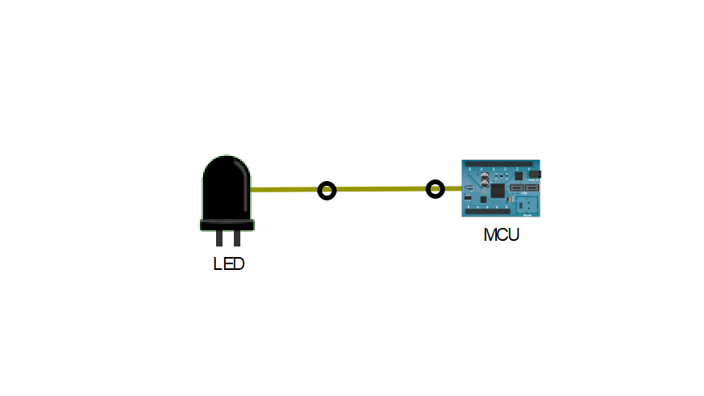
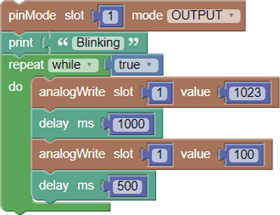
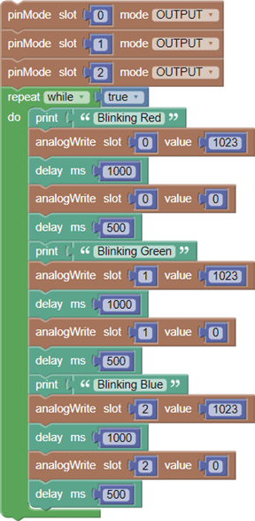

---

> **ВАЖНО**
> 
> Форма для ответов на вопросы будет доступна только при развертывании лабораторной работы 

---

## Топология

## Общие сведения

Blockly — это визуальный язык программирования, который позволяет пользователям создавать программы, соединяя блоки, представляющие различные структуры логического языка, а не путем написания фактического кода. Blockly работает в веб-браузере и может переводить визуально созданную программу в JavaScript, PHP или Python. В этом задании для Packet Tracer Вы будете использовать Blockly для изучения программирования Blockly и управления светодиодом.

## Сценарий

Использование программирования Blockly для управления светодиодом IoT-объекта. В этом задании используется Cisco Packet Tracer, поскольку он обеспечивает поддержку Blockly с IoT-объектами.

## Инструкции

### Часть 1. Изучить готовую программу в Blockly

В этой части Вы воспользуетесь Cisco Packet Tracer и изучите управление светодиодами с помощью программирования Blockly.

### Шаг 1: Изучить использование светодиода.

1. Нажмите на **LED**, чтобы открыть окно конфигурации.

2. Ознакомьтесь со спецификацией светодиода. Эта информация необходима при программировании светодиода позже в этом задании. Оставьте окно открытым для справки.

### Шаг 2: Изучить готовую программу Blockly.

1. Нажмите на  **MCU**, чтобы открыть окно конфигурации.

2. Перейдите на вкладку ** Programming**, чтобы отобразить готовую программу Blockly.

3. Нажмите **Run**.

* ответьте на вопрос №1

4. Нажмите **Stop** и измените значение поля Value первого блока digitalWrite на **1023**.

5. Нажмите **Run**. Теперь светодиод должен мигать.

### Шаг 3: Перейти с цифрового на аналогоВый.

Спецификации светодиодов указывают, что для регулировки яркости устройства можно использовать analogWrite. На этом этапе Вы переключитесь с цифрового на аналогоВый и будете наблюдать за изменением яркости светодиода при изменении значений в программе.

1. На вкладке **Programming** в **MCU** нажмите на  группу **Pin Access**, чтобы увидеть все параметры.

2. Выберите **analogWrite** для замены **digitalWrite** в программе Blockly. Оставьте все остальные значения прежними.

3. Теперь измените значения первого и второго блоков **analogWrite** и наблюдайте за различными уровнями яркости светодиодов после перезапуска программы. Например, измените значения на 100 и 1023, чтобы увидеть разные уровни яркости светодиодов.

4. Нажмите **Stop**, чтобы остановить программу.

### Часть 2. Управление светодиодом RGB с помощью Blockly

В этой части Вы будете использовать Blockly для управления RGB светодиодом. RGB может отображать разные цвета с комбинацией красного, зеленого и синего.

### Шаг 1: Добавьте плату MCU и RGB светодиод.

На этом шаге Вы добавите в рабочее пространство еще одну плату MCU и RGB светодиод.

1. Скопируйте **MCU** в рабочую область. Выделив **MCU**, скопируйте (Ctrl + C) и вставьте (Ctrl + V) её в рабочую область. Дважды щелкните на отображаемое имя скопированной платы и переименуйте MCU(1) в **MCU-RGB**.

2. Нажмите **Components**, Выберите **Actuators** и добавьте **RGB LED** (Светодиод) в рабочую область. Переименуйте **RGB LED** в **LED-RGB**.

### Шаг 2: Подключить плату MCU к RGB светодиоду.

1. Нажмите на  **RGB LED**, чтобы просмотреть его характеристики. Просмотрите предоставленную информацию, чтобы правильно подключить и запрограммировать светодиод. Обратите внимание, что разные входы контактов представляют разные цвета. Оставьте окно открытым.

2. Нажмите на  категорию **Connections** (Подключения), Выберите три **IoT Custom Cables* для соединения **MCU-RGB** и **LED-RGB**.

Согласно спецификациям RGB светодиодов:

A0: красный

A1: зеленый

A2: cиний

Поэтому порт *MCU-RGB D0* подключен к порту *RGB-LED A0* для красного цвета светодиода.

**Примечание**. На плате MCU убедитесь, что Вы подключены к цифроВым портам (D0, D1 и D2). Со стороны светодиодов используются аналогоВые порты (A0, A1, A2).

3. Повторите ту же процедуру для зеленого и синего цветов светодиодов.

Зеленый: MCU-RGB **D1** к LED-RGB **A1**

Синий:  MCU-RGB **D2** к LED-RGB **A2**

Шаг 3: Изменить программу Blockly.

На этом этапе Вы запрограммируете RGB светодиод , изменив программу, используемую для одноцветного светодиода.

1. Нажмите на  **MCU-RGB**. Нажмите на  **Programming**. Вы должны увидеть модифицированную в предыдущей части программу для управления одноцветным светодиодом.

2. Разверните группу **Pin Access** и добавьте еще два блока **pinMode**, чтобы установить три слота в качестве **OUTPUT** (от MCU-RGB для отправки сигнала на RGB-LED).

3. Введите значения для слотов 1, 2 и 3 для каждого цвета светодиода.

4. В цикле повторения добавьте блоки, чтобы контролировать, когда и в течение какого времени горит каждый цвет. Ниже приведен пример программы:

5. Нажмите **Run**. Светодиод должен последовательно отображать КРАСНЫЙ, ЗЕЛЕНЫЙ и СИНИЙ. Если программа не запущена, проверьте правильность подключения кабелей.

### Часть 3: Трудное испытание

Измените программу, чтобы отобразить комбинированный цвет из всех трех входных данных используя разные, случайно сгенерированные значения для каждого слота.

* ответьте на вопрос №2

[Скачать файл Packet Tracer для локального запуска](./assets/2.2.3-packet-tracer-blink-an-led-using-blockly.pka)
