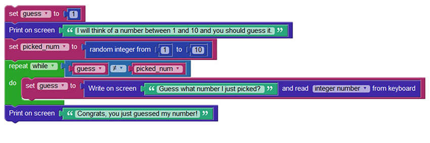

<!-- 2.3.1 -->

## Что такое Python?

Python — очень популярный язык, который разработан так, чтобы его было легко читать и писать. Сообщество разработчиков Python повышает ценность языка, создавая всевозможные модули и делая их доступными для других программистов.

Основная философия языка резюмирована в документе The Zen of Python:

* Красивое лучше, чем уродливое
* Явное лучше, чем неявное
* Простое лучше, чем сложное
* Сложное лучше, чем запутанное
* Читаемость имеет значение

Несмотря на то, что Python разработан так, чтобы быть простым, все же существует кривая обучения. Чтобы упростить изучение Python, новичок может использовать Blockly для улучшения своего понимания Python.

Новички могут использовать Blockly, чтобы легко создать независимую от языка программу, экспортировать ее как код Python и использовать этот вновь созданный код для изучения синтаксиса, структуры и семантики Python.



### Игра в угадайку на Python

```python
import random

guess = None 
picked_num = None

guess = 1
print("Я придумаю число от 1 до 10, а Вы должны его угадать.")
picked_num = random.randint(1, 10)
while guess != picked_num:
         guess = int(input("Угадайте, какое число я только что выбрал?"))
print("Поздравляю, Вы только что угадали моё число!")
```

<!-- 2.3.2 --> 
## Интерпретатор Python

Python — это интерпретируемый язык; поэтому для разбора и выполнения кода Python требуется интерпретатор. Интерпретатор Python понимает и выполняет код Python. Код Python можно создать в любом текстовом редакторе, а интерпретаторы Python доступны для многих операционных систем. Python-разработчики могут создавать и развертывать программы Python практически в любой операционной системе.

На машинах с Linux интерпретатор Python обычно устанавливается в **/usr/bin/python3**. С помощью установщика Python для Windows установка по умолчанию совершается в корневой каталог пользователя. На старых компьютерах с Windows Python часто размещается в **C:\PythonXX** (где XX — версия Python). После установки интерпретатор Python работает примерно так же, как оболочка Linux. Это означает, что при вызове без аргументов он считывает и выполняет команды в интерактивном режиме. При вызове с аргументом имени файла или с файлом в качестве стандартного ввода он считывает и выполняет сценарий из этого файла.

Чтобы запустить интерпретатор, просто введите **python3** в командной строке.

Некоторые устаревшие системы все еще используют Python 2. Однако последняя версия Python 2 была выпущена в октябре 2000 года. Python 3 следует считать текущим стандартом. Этот курс построен на коде Python 3. Версия Python указана в первой строке при запуске интерпретатора.

### Приветственное сообщение интерпретатора Python

````markdown
Python 3.6.5 (default, Apr 16 2018, 15:31:49)
[ GCC 4.8.5 20150623 (RED Hat 4.8.5-16) ] on linux
Type "help", "copyright", "credits" or "license" for more information.
>>>
````

Когда интерпретатор Python вызывается без аргументов и команды вводятся с клавиатуры, говорят, что интерпретатор находится в интерактивном режиме. В этом режиме интерпретатор ожидает команды. Основное приглашение представлено тремя знаками «больше» (>>>). Линии продолжения представлены тремя точками (...). Продолжение — это вторичное приглашение по умолчанию.


Приглашение >>> указывает, что интерпретатор готов и ожидает команды.

**IF-THEN блок**

Строки продолжения необходимы при вводе многострочного кода.

### IF-THEN блок

````markdown
>>> the_world_is_flat = True
>>> if the_world_is_flat:
...     print ("Осторожно, не свались!")
...
Осторожно, не свались!
````

Другой способ использования интерпретатора - **python3 -c command [arg] ...**, что выполняет оператор (ы) в команде. Поскольку операторы Python часто содержат пробелы или другие символы, характерные для оболочки, рекомендуется заключать всю команду в одинарные кавычки.

<!-- 2.3.3 --> 
Переменные и основные операторы в Python

Интерпретатор получает и выполняет операторы в интерактивном режиме.

Интерпретатор действует как простой калькулятор. Вы можете напечатать на нем выражение, и он запишет значение. Синтаксис выражения прост. Операторы +, -, * и / работают так же, как и в большинстве других языков (например, Pascal или C). Круглые скобки (()) можно использовать для группировки.

**Группировка со скобками**

````markdown
>>>
>>> 25+ 25
50
>>> 70 + 7*6
112
>>> (50 - 5.0*6) / 4
5.0
````

Интерактивный режим Python реализует специальную переменную “_” для хранения результата последнего выполненного выражения.

**Использование специальной переменной**

````markdown
>>> tax = 12.5 / 100
>>> price = 100.50
>>> price * tax
12.5625
>>> price + _
113.0625
>>> round(_, 2)
113.06
````

Переменные — это помеченные области памяти, которые используются для хранения данных исполняемой программы. Чтобы присвоить значения переменным в Python, используйте знак равенства (=). До следующего интерактивного приглашения результат не отображается.

**Назначение и использование переменных**

````markdown
>>> birth_year = 1941
>>> curr_year = 2016
>>> curr_year - birth_year
75
````

Попытки использовать не определенную переменную (без присвоенного значения) приведут к ошибке.

**Ошибка неопределенной переменной**

````markdown
>>>
>>> my_new_variable
Traceback (most recent call last):
        File "<stdin>", line 1, in
NameError: name 'my_new_variable' is not defined
>>>
````

Строки, которые определяются как последовательность символов, также могут обрабатываться в интерактивном режиме. Используйте символ обратной косой черты (\) для экранирования символов. Например, строковое значение использует двойные кавычки, но также содержит двойные кавычки внутри строки. Если строка введена следующим образом: "Мне действительно "нужно" это.". Python запутается и подумает, что первая двойная кавычка в строке на самом деле завершает строку. Если Вы поместите обратную косую черту (\) перед двойными кавычками следующим образом: “Мне действительно \"нужно\" это”, обратная косая черта (\) заставляет Python экранировать или игнорировать следующий символ.

Для переноса строк можно использовать одинарные или двойные кавычки.

**Использование кавычек для переноса строк**

````markdown
>>>
>>>'варёные раки' # одинарные кавычки
'варёные раки'
>>> 'д\'Артаньян' # используйте \' для экранирования одинарной кавычки...
"д'Артаньян"
>>> "д\'Артаньян" # ...или используйте двойные кавычки
"д'Артаньян"
>>> '"Да," сказал он.'
'"Да," сказал он.'
>>> "\"Да,\" сказал он."
'"Да," сказал он.'
````

Оператор печати печатает результат выражения, которое ему дали. Он отличается от простого написания выражения, которое Вы хотите написать (как мы делали ранее в примерах с калькулятором), тем, как он обрабатывает несколько выражений и строк. Строки печатаются без кавычек, а между элементами вставляется пробел, так что Вы можете форматировать красиво.

**Форматирование строкового вывода**

````markdown
>>>
>>> i = 256*256
>>> print ('Значение i равно', i)
Значение i равно 65536
````


Функции являются важной частью многих языков программирования. Функции позволяют дать блоку кода имя и повторно использовать его по мере необходимости. В приведенном ниже примере кода определяется функция, которая складывает два числа и печатает результат.

**Функция для сложения двух чисел и печати результата**

````markdown
>>> # Функция для сложения двух чисел:
>>> def add_nums():
...      a = 5
...      b = 11
...      return a+b
...
>>> print (add_nums())
16
````

<!-- 2.3.4 -->
## Полезные функции и типы данных в Python

Python поддерживает множество полезных функций и типов данных. Вот некоторые из наиболее важных:

**Range()**

Функция range() генерирует список чисел, обычно используемых для итерации циклов FOR. Пример кода показывает использование функции range().

* range(stop) — это количество целых чисел, которые необходимо сгенерировать, начиная с нуля.
* range([start], stop, [step]) — это начальный номер последовательности, конечный номер последовательности и разница между каждым числом в последовательности.

**Примеры функции Range()**

````markdown
>>> # Один параметр
>>> for i in range(3):
...      print(i)
...
0
1
2
>>> # Два параметра
>>> for i in range(3,6):
...      print(i)
...
3
4
5
>>> # Три параметра
>>> for i in range(4, 10, 2):
...      print(i)
...
4
6
8
````

**Кортежи (tuples)**

Кортеж — это последовательность неизменяемых объектов Python. Кортежи — это последовательности, разделенные скобками. В примере показано использование кортежей.

**Пример кортежей Python**

````markdown
>>>
>>> tup1 = ('танцует', 'поёт', 400, 1842);
>>> tup2 = (1, 2, 3, 4, 5, 6, 7 );
>>> print ('tup1[0]: ', tup1[0])
>>> print ('tup2[1:5]: ', tup2[1:5])

Когда приведенный выше код выполняется, он выдает следующий результат -
tup1[0]: танцует
tup2[1:5]: (2, 3, 4, 5)
````

**Списки (lists)**

Списки — это последовательность изменяемых объектов Python. Списки можно создавать, помещая различные значения, разделенные запятыми, между квадратными скобками. В примере кода показаны списки и способы их обновления.

**Примеры списков на Python**

````markdown
>>>
>>> list1 = ['машина', 'поезд', 47, 2016];
>>> list2 = [1, 2, 3, 4, 5, 6, 7 ];
>>> print ('list1[0]: ', list1[0])
>>> print ('list2[1:5]: ', list2[1:5])

Когда приведенный выше код выполняется, он выдает следующий результат -
   list1[0]: car
   list2[1:5]: [2, 3, 4, 5]
````

````markdown
>>>
>>> list = ['машина', 'поезд', 47, 2016];
>>> print ('Значение доступно по индексу 2 : ')
>>> print (list[2])
>>> list[2] = 2017;
>>> print ('Новое значение доступно по индексу 2 : ')
>>> print (list[2])

Когда приведенный выше код выполняется, он выдает следующий результат -
   Значение доступно по индексу 2 :
   47
   Новое значение доступно по индексу 2 :
   2017
````

**Наборы (sets)**

Наборы — это неупорядоченные наборы уникальных элементов. Обычное используется для проверки принадлежности, удаления дубликатов из последовательности и вычисления операций стандартного набора, таких как пересечение, объединение, разность и симметричная разность. В примерах показано использование наборов.

**Примеры наборов на Python**

````markdown
>>>
>>> x = [1,2,3,1,2,3,1,2,3]
>>> set(x) 
{1, 2, 3}
>>> y = [1, 1, 6, 6, 6, 6, 6, 8, 8]
>>> set(y)
{1, 6, 8}
>>> z = [("Птица", "Кошка", "Собака", "Собака", "Птица", "Птица")]
>>> set(z)
{('Птица', 'Кошка', 'Собака', 'Собака', 'Птица', 'Птица')}
````

````markdown
>>> animals = set(["Корова", "Рыба", "Свинья", "Лошадь"])
>>> animals.add ("Кошка")
>>> print (animals)
{'Свинья', 'Корова', 'Кошка', 'Рыба', 'Лошадь'}
>>>
>>> for group in [animals]:
...    group.discard ("Рыба")
...    print(group)
...
{'Свинья', 'Корова', 'Кошка', 'Лошадь'}
````

**Словари (dictionary)**

Словарь представляет собой список элементов, разделенных запятыми. Каждый элемент представляет собой комбинацию значения и уникального ключа. Каждый ключ отделяется от его значения двоеточием. Весь словарь записывается в фигурных скобках. Элементы словаря могут быть доступны, обновлены и удалены. Существует также множество встроенных словарных функций, таких как функция, которая сравнивает элементы в разных словарях, или которая подсчитывает общее количество элементов в словаре. В примерах показаны различные операции со словарями.

**Пример словаря с четырьмя элементами**

````markdown
>>> dict = {'Возраст' : 34, 'Город' : 'Рим', 'Год' : 2016, 'Месяц' : 'Март' }
>>> print ("dict['Город']: ", dict['Город'])
dict['Город']: Рим
>>> print ("dict['Год']: ", dict['Год'])
dict['Год']: 2016
````

**Пример обновления словарного значения**

````markdown
>>> dict['Год'] = 2015
>>> print ("dict['Год']: ", dict['Год'])
dict['Год']: 2015
````

**Пример добавления нового элемента и отображение количества элементов в словаре**

````markdown
>>>
>>> dict['Спорт'] = "Плавание"
>>> len(dict)
5
````

<!-- 2.3.5 --> 
## Структуры программирования в Python

Python включает в себя ряд структур (или конструкций) программирования, как и другие языки. Структуры программирования составляют основу логики программы.

### Структуры IF-THEN

Подобно другим языкам, Python реализует структуру IF-THEN. Блоки IF-THEN можно использовать, чтобы позволить коду принимать решения на основе результата выражения, как показано в примере.

**IF-THEN, ELSE, ELIF**

````markdown
>>> x = int(input("Введите целое число: "))
Введите целое число: 42
>>> if x < 0:
...      x = 0
...      print('Отрицательное значение изменено на ноль')
...  elif x == 0:
...      print ('Ноль')
...  elif x == 1:
...      print('Единица')
...  else:
...      print('Больше')
...
Больше
````

Код примера выполняет несколько тестов и выводит сообщение в соответствии с результатами теста. Обратите внимание, что Python также реализует две подструктуры с именами ELSE и ELIF. ELSE позволяет программисту указать инструкции, которые должны выполняться, если выражение ложно. Сокращение от ELSE IF, ELIF используется для выполнения второго теста в случае, если первое выражение ложно и требуется другой тест. ELIF может быть ноль или более, а часть ELSE необязательна.

### Цикл FOR

Цикл FOR в Python перебирает элементы любой последовательности (списка или строки) в том порядке, в котором они появляются в последовательности, как показано в примере.

**Цикл FOR**

````markdown
>>> # Измерить несколько строк:
>>> words = ['кот', 'окно', 'выкинуть']
>>> for w in words:
...     print (w, len(w))
...
кот 3
окно 4
выкинуть 8
````

### Цикл WHILE

Цикл WHILE выполняет блок кода, если выражение истинно. В примере программы используется цикл WHILE для вычисления и печати начальной подпоследовательности ряда Фибоначчи, в которой каждое число в ряду является суммой двух предыдущих.

**Цикл WHILE**

````markdown
>>> # Последовательность Фибоначчи:
>>> # сумма двух элементов определяет следующий
>>> a, b = 0, 1
>>> while b < 10:
...     print (b)
...     a, b = b, a+b
...
1
1
2
3
5
8
```` 

Третья строка содержит оператор множественного присваивания. Переменные a и b получают новые значения 0 и 1 в одном операторе.

Цикл WHILE вычисляет следующий член ряда Фибоначчи, пока выполняется условие b < 10. Как и в языке C, Python принимает любое целочисленное значение, отличное от нуля, как истинное, а ноль — как ложное. Тест, показанный в примере, представляет собой простое сравнение.

Обратите внимание, что тело цикла имеет отступ. Это также относится к операторам в структурах цикла IF-THEN и FOR. Отступ — это способ группировки операторов в Python. В интерактивной подсказке Вы должны ввести табуляцию или пробел(ы) для каждой строки с отступом, иначе Ваш код не будет работать должным образом и могут возникнуть ошибки. Более сложный ввод для Python следует выполнять с помощью текстового редактора. Когда составной оператор вводится в интерактивном режиме, за ним должна следовать пустая строка, чтобы указать завершение (поскольку синтаксический анализатор не может угадать, какая строка будет последней строкой). Обратите внимание, что каждая строка в блоке должна иметь одинаковый отступ.
