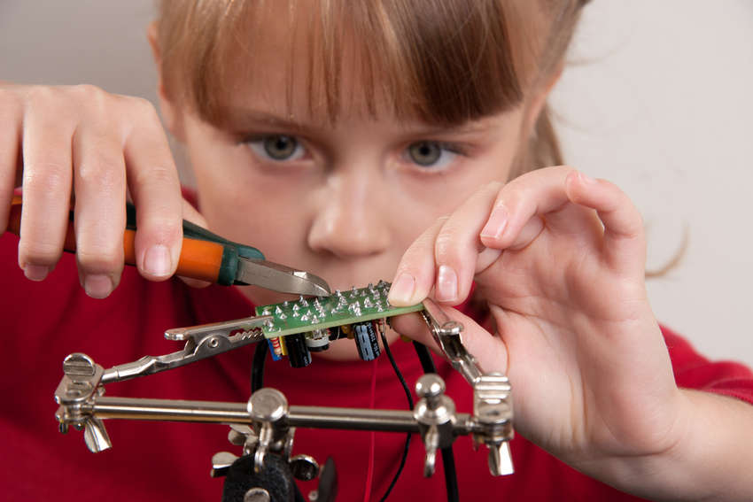

<!-- 2.4.1 --> 
## Определение прототипирования

Для прототипирования (или разработки упрощенной модели) в Интернете вещей полезно иметь навыки проектирования, навыки работы с электроникой и физические/механические навыки (работа руками, чтобы мастерить вещи). Навыки работы в сети и программирования также чрезвычайно ценны. Кроме того, IoT-разработчики также извлекают выгоду из знаний об облачных вычислениях, и безопасности сети и устройств.

Поскольку IoT находится в процессе развития, еще предстоит обнаружить неизвестные задачи. Это прекрасное время, чтобы изобрести что-то, что будет являться частью IoT. Поскольку IoT объединяет людей, процессы, данные и вещи - нет предела изобретениям, которые IoT может помочь создать, а затем внедрить.

**Прототипирование**

* Полностью работоспособно, но не безотказно.
* Является актуальной рабочей версией продукта.
* Используется для оценки производительности и дальнейшего улучшения продукта.
* Имеет завершенный внутренний и внешний вид.
* Может быть относительно дорогим в производстве.
* В IoT часто используется в качестве демонстрации технологий.

<!-- 2.4.2 --> 
## Как создать прототип

Как можно создать прототип? Есть несколько способов начать. Команда Google использовала «метод быстрого прототипирования» для создания Google Glass. Поищите в Интернете «google glass быстрое прототипирование ted talk», чтобы просмотреть видео о подходе Google к прототипированию.

Конечно, у Google есть много денег, чтобы заплатить за людей и материалы, которые идут на прототипирование. Большинству из нас нужна финансовая помощь, чтобы превратить наши идеи из головы в прототип. Для нас существует краудфандинг. Kickstarter, Indiegogo и Crowdfunder — это лишь три из множества онлайн-программ краудфандинга. Найдите в Интернете «Видео Pebble Time Kickstarter». Это онлайн-видео было использовано для сбора пожертвований, чтобы помочь этой группе изобретателей создать умные часы Pebble Time.

Какое изобретение для Интернета вещей создадите Вы?

