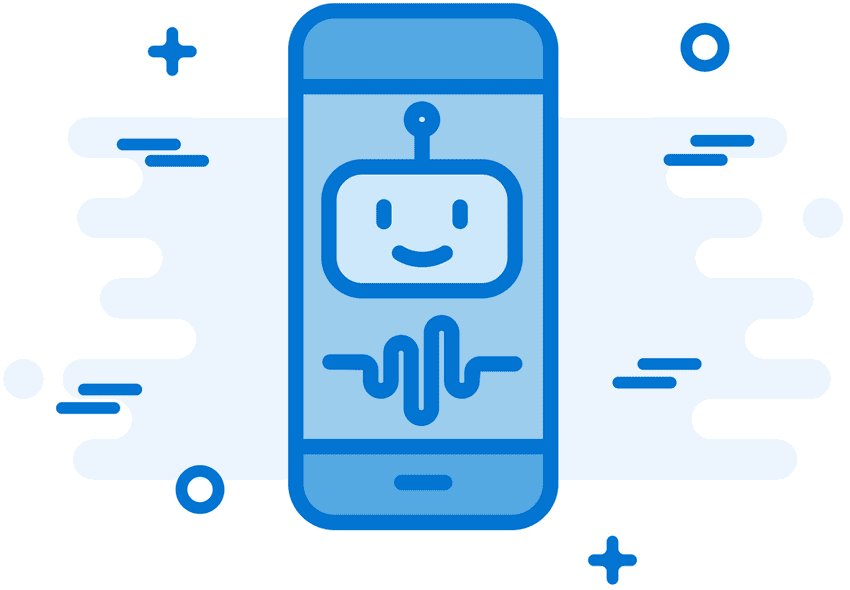

<!-- 2.5.1 --> 
## Физические материалы

Хорошим местом для начала, конечно же, является Интернет. Люди веками обменивались идеями, но Интернет позволяет обмениваться идеями на совершенно новом уровне. Люди, которые никогда не встречались физически, теперь могут сотрудничать и работать вместе. Есть несколько веб-сайтов, которые Вы можете посетить, чтобы общаться с другими изобретателями.

Maker Media — это глобальная платформа для общения изготовителей друг с другом с целью обмена проектами и идеями. Платформа также предоставляет место, где изготовители могут найти и купить продукты для своих проектов. Для получения дополнительной информации поищите в Интернете Makezine.

Полезно иметь практические навыки при работе с определенными материалами. Например, дерево и металл являются распространенными материалами для прототипирования, но они могут быть слишком сложными для новичка. Вы можете быть удивлены тем, что можно делать с пластиком, глиной, бумагой и проволокой. Поищите в Google дополнительную информацию или идеи о том, как работать с различными материалами для прототипирования.

Meccano, или Erector Set, представляет собой модельную строительную систему, состоящую из многоразовых металлических полос, пластин, угловых балок, колес, осей и шестерен, с гайками и болтами для соединения частей. Он позволяет создавать рабочие прототипы и механические устройства. Найдите в Интернете Mecanno, чтобы узнать больше.

3D-печать — это процесс создания твердого объекта на основе компьютерного файла 3D-модели. К компьютеру подключена машина, называемая 3D-принтером. Сейчас многие компании производят и продают 3D-принтеры. Перейдите на сайт Makerbot в Интернете, чтобы узнать больше об одном из производителей 3D-принтеров.

<!-- 2.5.2 --> 
## Электронные инструменты

Компьютерные программы не могут работать без компьютера. Хотя Вы можете создавать программы практически для любого компьютера, некоторые платформы предназначены для новичков. Ниже Вы найдете некоторые из самых популярных платформ.

Arduino — это физическая вычислительная платформа с открытым исходным кодом, основанная на простой плате микроконтроллера и среде разработки для написания программного обеспечения для этой платы. Вы можете разрабатывать интерактивные объекты, которые получают данные от различных переключателей или датчиков для управления освещением, приводами и другими физическими объектами. Перейдите на страницу Arduino по адресу http://arduino.cc.

Хотя Arduino не подходит для использования в качестве компьютера, его низкое энергопотребление позволяет эффективно управлять другими устройствами.

Raspberry Pi — это недорогой компьютер размером с кредитную карту, который подключается к компьютерному монитору или телевизору. Вы управляете им с помощью стандартной клавиатуры и мыши. Он способен делать все, что может делать компьютер, от работы в Интернете и воспроизведения видео высокой четкости до создания электронных таблиц, обработки текстов, и запуска компьютерных игр. Перейдите на Raspberry Pi по адресу http://www.raspberrypi.org.

Beaglebone очень похож на Raspberry Pi по размеру, требованиям к питанию и применению. Beaglebone обладает большей вычислительной мощностью, чем Raspberry Pi; следовательно, это лучший выбор для приложений с более высокими требованиями к обработке. Перейдите на сайт Beaglebone по адресу http://beagleboard.org.

Наконец, Adafruit — фантастический ресурс для ваших IoT-проектов. Они предлагают широкий спектр электронных компонентов и инструментов. Кроме того, на веб-сайте Adafruit есть множество руководств по разработке электронных проектов, которые могут быть полезны изучающим IoT.

<!-- 2.5.3 --> 
## Источники информации по программированию

Программирование крайне важно для IoT. Создание пользовательского кода очень полезно при разработке программных решений. Вы уже узнали о Blockly и Python. Есть много других бесплатных ресурсов, которые могут помочь Вам развить навыки программирования.

MIT OpenCourseWare (OCW) — это публикация почти всего содержания курсов MIT на сайте. Открытый и доступный для всего мира, OCW — отличное место, где можно бесплатно познакомиться с компьютерным программированием. Курсы по программированию OCW можно найти по адресу http://ocw.mit.edu/courses/intro-programming.

Khan Academy — это некоммерческий образовательный веб-сайт, созданный в 2006 году для предоставления «бесплатного образования мирового уровня для всех и везде». Лекции, связанные с компьютерным программированием, можно найти по адресу https://www.khanacademy.org/computing/cs.

Code Academy — еще один отличный ресурс. Он опирается на интерактивность, чтобы помочь людям научиться писать компьютерные программы. Вы можете найти их на http://www.codeacademy.com.

<!-- 2.5.4 --> 
## Семинары по изобретательству и предпринимательству от сообществ 

Итак, возможно, Вы только что создали что-то действительно замечательное. Что теперь? Существует ряд мест, где Вы можете получить помощь в представлении Вашей идеи или прототипа другим.

Изучите, что доступно в Dашем сообществе. Обратитесь в местные органы власти, школы и торговую палату для получения информации о семинарах, занятиях и советах экспертов.

В Интернете есть много ресурсов, которые помогут Вашей идее заявить о себе. Хороший пример — Quirky. Quirky позволяет пользователям делиться своими идеями. Когда идея отправлена, другие пользователи Quirky могут проголосовать и решить, хотят ли они поддержать Вашу идею. Если идея хороша, она может стать реальным продуктом. Вы можете узнать больше о Quirky на странице https://quirky.com/about-quirky/.

<!-- 2.5.5 --> 
## ЙоТа — Размышления

Ну что? Я же Вам говорила! Базовое программирование не должно быть сложным. Это может быть действительно весело! Я не знала этого, пока не прошла этот модуль. Теперь, когда Вы создали блок-схему процесса и использовали Blockly и Python, у вас есть довольно мощные стартовые инструменты. Что Вы можете придумать для IoT? Как можно начать с простого прототипа? Это может быть что-то забавное, например, создание программы для игрушки с дистанционным управлением, которая будет играть с Вашей кошкой, когда Вас нет рядом. Или это может что-то полезное, например, создание программы для термодатчика, установленного на кроватку новорожденного ребенка. Бьюсь об заклад, что как только Вы добьетесь небольшого успеха в создании прототипов в IoT, Вы начнете смотреть на свой мир совсем по-другому.
