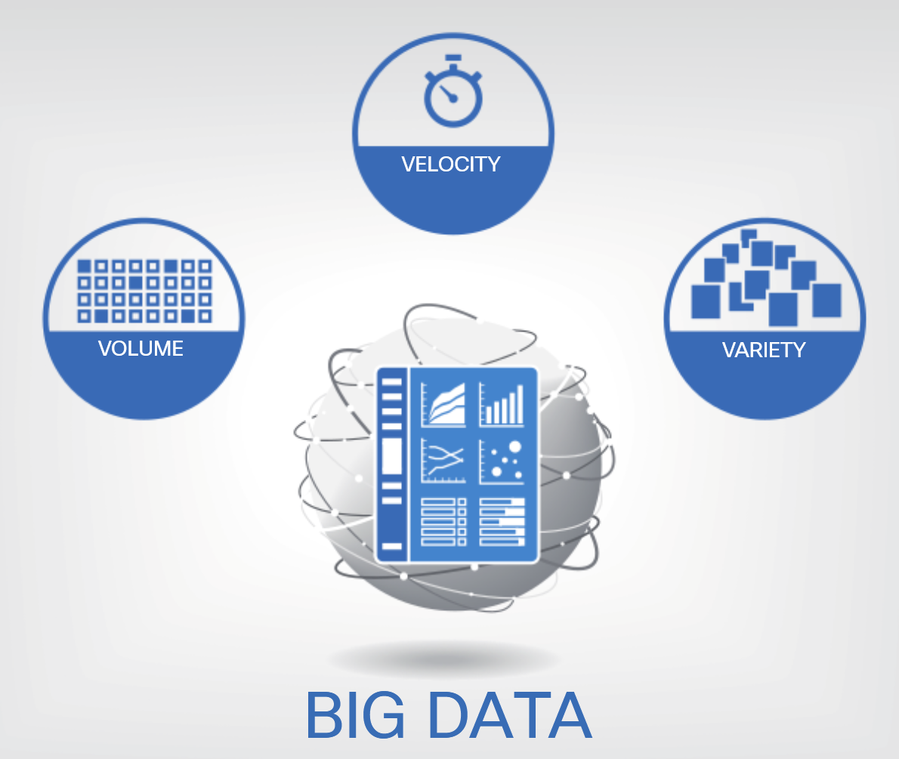

<!-- 3.1.1  -->
## Что такое большие данные (Big Data)?

Данные поступают из различных источников, таких как люди, изображения, текст, датчики и веб-сайты. Данные также поступают с таких устройств, как сотовые телефоны, компьютеры, киоски, планшеты и кассовые аппараты. Совсем недавно произошел всплеск объема данных, генерируемых датчиками. Они сейчас устанавливаются во все большем количестве локаций и объектов. К ним относятся камеры видеонаблюдения, светофоры, умные автомобили, термометры и даже виноградные лозы!

Большие данные (Big Data) — это много данных, но «много» это сколько? Ни у кого нет точного числа, указывающего, когда данные организации считаются «большими данными». Вот три характеристики, которые указывают на то, что организация может иметь дело с большими данными:

* Они имеют большой объем данных, для хранения которых требуется все больше места (объем).
* У них есть объем данных, который очень быстро растет (скорость).
* У них есть данные, которые генерируются в разных форматах (разнообразие).

Сколько данных собирают датчики? Вот несколько приблизительных примеров. Для сравнения предположим, что средний размер песни в формате MP3 составляет около 3 мегабайт.

* Датчики в одном умном подключенном доме могут производить до 1 гигабайта (ГБ) информации в неделю, что эквивалентно 333 песням в формате MP3.
* Датчики в одном автономном автомобиле могут генерировать 4000 гигабит (Гб) данных в день. Это 500 гигабайт (ГБ) данных, что эквивалентно примерно 167 000 песен в формате MP3.
* Датчики безопасности при добыче полезных ископаемых могут генерировать до 2,4 терабит (ТБ) данных каждую минуту. Это 300 ГБ или около 100 000 песен в формате MP3.
* Двигатель Airbus A380 генерирует 1 петабайт (ПБ) данных во время полета из Лондона в Сингапур. Это один миллион ГБ или около 334 миллионов песен в формате MP3.

Хотя большие данные создают проблемы для организаций с точки зрения хранения и аналитики, они также могут предоставить бесценную информацию для точной настройки операций и повышения удовлетворенности клиентов.

<!-- https://dmazqqf7fxgsj.cloudfront.net/netacad-media/graphics/e18de380-524b-11ec-a117-0f1740ce7119/assets/images/8a1b1f7d-5160-4afa-b10a-eb21ba9c2e15.svg -->

<!-- 3.1.4  -->
## Большие наборы данных

Компании не обязательно должны генерировать свои собственные большие данные. Небольшие организации могут не иметь датчиков, большого количества клиентов или возможности генерировать разнообразную информацию, которая могла бы принести пользу их компании. Доступны источники бесплатных наборов данных, готовых к использованию и анализу любым желающим их искать.

Многие компании разного размера считают, что им необходимо собирать собственные данные, чтобы увидеть преимущества аналитики больших данных, но это просто неправда.