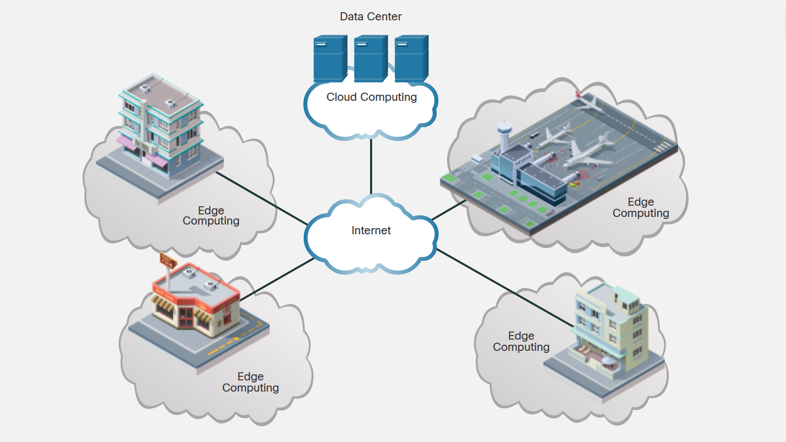

<!-- 3.2.1  -->
## Какие есть трудности, связанные с большими данными?

Всемирный экономический форум прогнозирует, что объем данных, генерируемых ежедневно, составит 463 эксабайта (ЭБ) во всем мире. Один ЭБ равен одному миллиарду гигабайт! Для сравнения, согласно Statista, каждую минуту каждого дня:

* Мы загружаем более 500 часов видео на YouTube.
* Мы отправляем более 69 миллионов мгновенных сообщений.
* Мы смотрим более 347 000 ГБ видео на Netflix.
* Мы отправляем 198 миллионов электронных писем.
* Мы загружаем более 60 000 изображений в Instagram.

Чтобы увидеть более динамичную интернет-статистику, выполните поиск по запросу «интернет-статистика в реальном времени».

Быстрый рост данных может быть как преимуществом, так и препятствием для достижения бизнес-целей. Чтобы стать успещными, предприятия должны иметь возможность легко получать доступ к своим информационным активам и управлять ими.

При постоянном создании такого огромного объема данных традиционные технологии и хранилища данных не могут удовлетворить потребности в хранении. Даже при наличии облачных хранилищ, доступных от таких компаний, как Amazon, Google, Microsoft и многих других, безопасность хранимых данных становится большой проблемой. Технологии для работы с большими данными должны быть безопасными, иметь высокую отказоустойчивость и использовать средства копирования, чтобы данные не терялись. Хранилище больших данных — это не только хранение данных, но и управление ими и их защита.

Более интересные статистические данные о росте и тенденциях в Интернете см. в [ежегодном отчете Cisco об Интернете](https://www.cisco.com/c/en/us/solutions/collateral/executive-perspectives/annual-internet-report/white-paper-c11-741490.html).

<!-- 3.2.2  -->
## Где мы можем хранить большие данные?

Большие данные обычно хранятся на нескольких серверах, обычно размещенных в центрах обработки данных. В целях безопасности, доступности и избыточности данные обычно распределяются и/или копируются на множество разных серверов в разных центрах обработки данных.

### Граничные вычисления

Граничные вычисления — это архитектура, в которой используются клиенты или устройства конечных пользователей на границе сети для выполнения значительного объема предварительной обработки и хранения, необходимых конкретной организации. Граничные вычисления были разработаны, чтобы держать данные ближе к источнику данных для предварительной обработки.

В частности, данные датчиков могут быть предварительно обработаны ближе к тому месту, где они были собраны. Информация, полученная в результате этого предварительно обработанного анализа, может быть возвращена в системы компаний для изменения рабочих процессов, если это необходимо. Поскольку данные датчиков предварительно обрабатываются конечными устройствами в системе компании, обмен данными с серверами и устройствами происходит быстрее. Это требует меньшей пропускной способности, чем постоянная отправка необработанных данных в облако.

После предварительной обработки данные часто отправляются дальше для более длительного хранения, резервного копирования или более глубокого анализа в облаке.

<!-- https://dmazqqf7fxgsj.cloudfront.net/netacad-media/graphics/96c99e50-531f-11ec-a816-693461c35385/assets/images/0a942f97-38e5-47ca-bade-ff6e2ec2f2f4.svg -->

<!-- 3.2.3  -->
## Облако и облачные вычисления

Как упоминалось ранее, облако представляет собой набор центров обработки данных или групп связанных серверов. Доступ к программному обеспечению, хранилищам и службам, доступным на серверах, осуществляется при помощи Интернета через интерфейс браузера. Облачные услуги предоставляются многими крупными компаниями, такими как Google, Microsoft и Apple. Услуги облачного хранилища предоставляются разными поставщиками, такими как: Google Drive, Apple iCloud, Microsoft OneDrive и Dropbox.

С точки зрения индивидуального пользователя использование облачных сервисов позволяет:
* Хранить всех Ваши данные, такие как изображения, музыка, фильмы и электронные письма, освобождая место на локальном жестком диске.
* Получать доступ ко многим приложениям вместо их загрузки на локальное устройство.
* Получать доступ к Вашим данным и приложениям в любом месте, в любое время и на любом устройстве

Одним из недостатков использования облака является то, что Ваши данные могут попасть не в те руки. Ваши данные зависят от надежности безопасности выбранного Вами облачного провайдера.

С точки зрения предприятия облачные сервисы и вычисления помогают с решением множества вопросов управления данными:

* Они обеспечивают доступ к организационным данным в любом месте и в любое время.
* Оптимизируют ИТ-операции организации, подписываясь только на необходимые услуги.
* Они устраняют или уменьшают потребность в локальном ИТ-оборудовании, обслуживании и управлении.
* Они снижают затраты на оборудование, энергию, требования к физическим объектам и потребность в обучении персонала.
* Они позволяют быстро реагировать на растущие требования к объему данных.

<!-- 3.2.4  -->
## Распределенная обработка данных 

С точки зрения управления данными аналитика была простой, когда данные создавали только люди. Объем данных был управляемым и относительно легко просеивался. Однако с появлением систем автоматизации бизнеса и экспоненциальным ростом веб-приложений и машинно-генерируемых данных управлять аналитикой становится все труднее. На самом деле, 90% данных, которые существуют сегодня, были созданы всего за последние два года. Этот увеличенный объем за короткий период времени является свойством экспоненциального роста. Такой большой объем данных трудно обрабатывать и анализировать в разумные сроки.

Вместо того чтобы обрабатывать большие базы данных большими и мощными мейнфреймами и хранить их в гигантских дисковых массивах (вертикальное масштабирование), **распределенная обработка данных** берет большой объем данных и разбивает его на более мелкие части. Эти меньшие объемы данных распределяются по многим местам для обработки большим количеством компьютеров с процессорами поменьше. Каждый компьютер в распределенной архитектуре анализирует свою часть картины больших данных (горизонтальное масштабирование).

Большинство распределенных файловых систем спроектированы так, чтобы быть невидимыми для клиентских программ. Распределенная файловая система находит файлы и перемещает данные, но пользователи не могут знать, что файлы распределены между множеством различных серверов или узлов. Пользователи получают доступ к этим файлам, как если бы они были локальными для их собственных компьютеров. Все пользователи видят одно и то же представление файловой системы и могут получать доступ к данным одновременно с другими пользователями.

Hadoop был создан для работы с этими большими объемами данных. Проект Hadoop начался с двух аспектов: распределенная файловая система Hadoop (HDFS) — распределенная, отказоустойчивая файловая система, и MapReduce — распределенный способ обработки данных. Теперь Hadoop превратился в комплексную экосистему программного обеспечения для управления большими данными.

Hadoop — это программное обеспечение с открытым исходным кодом, обеспечивающее распределенную обработку больших наборов данных, размер которых может достигать несколько терабайт и которые хранятся в кластерах компьютеров. Hadoop предназначен для масштабирования начиная от отдельных серверов до тысяч машин, каждая из которых предлагает локальные вычисления и хранилище. Чтобы сделать его более эффективным, Hadoop можно установить и запустить на многих виртуальных машинах. Все эти виртуальные машины могут работать вместе параллельно для обработки и хранения данных.

У Hadoop есть две основные функции, которые сделали его отраслевым стандартом для обработки больших данных:

* **Масштабируемость** - Кластеры большего размера повышают производительность и обеспечивают более высокие возможности обработки данных. С помощью Hadoop размер кластера можно легко масштабировать от кластера с пятью узлами до кластера с тысячей узлов без чрезмерного увеличения административной нагрузки.
* **Отказоустойчивость** — Hadoop автоматически копирует данные между кластерами, чтобы гарантировать, что данные не будут потеряны. Если диск, узел или целая стойка выходят из строя, данные в безопасности.
