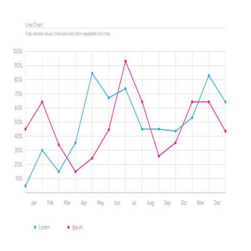
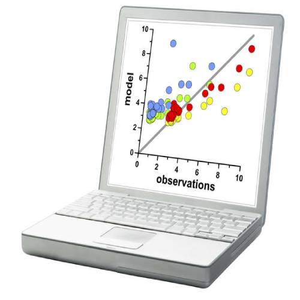
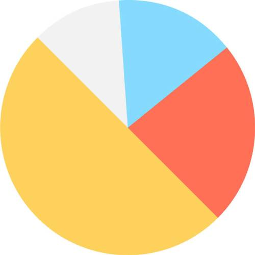
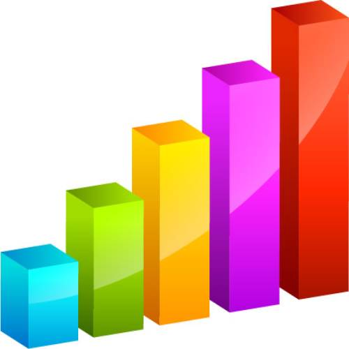
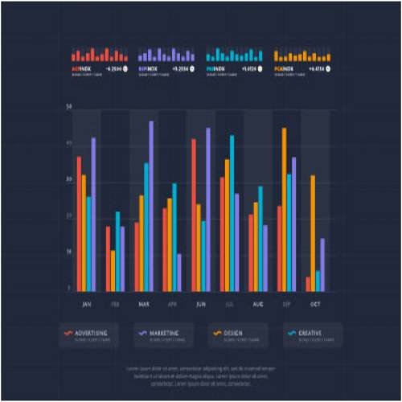

<!-- 3.3.1  -->
## Зачем компании анализируют данные?

Каждая организация должна становиться более эффективной и инновационной, чтобы оставаться конкурентоспособной и актуальной в цифровом мире. Интернет вещей является неотъемлемой частью достижения этой эффективности и инновационности.

Цель многих предприятий — собрать и проанализировать огромное количество данных об использовании новых продуктов, чтобы получить ценную информацию. Аналитика данных позволяет компаниям лучше понимать влияние своих продуктов и услуг, корректировать свои методы и цели, и быстрее предоставлять своим клиентам более качественные продукты. Возможность извлекать новые идеи из своих данных приносит пользу бизнесу.

Для бизнеса данные — это новая нефть. Как и сырая нефть, они ценны, но если они не очищены, их нелегко использовать. Сырая нефть должна быть переработана в бензин, пластик, химикаты и другие вещества, чтобы создать ценный продукт. То же самое и с данными. Данные должны быть разбиты и проанализированы, чтобы они имели ценность.

Ценность исходит из двух основных типов обрабатываемых данных: транзакционных и аналитических. Транзакционная информация собирается и обрабатывается по мере возникновения событий. Транзакционная информация используется для анализа ежедневных отчетов о продажах и производственных графиков, чтобы определить, сколько запасов необходимо хранить. Аналитическая информация поддерживает задачи управленческого анализа, такие как определение того, следует ли организации построить новый завод или нанять дополнительный торговый персонал.

<!-- 3.3.2 -->
## Источники информации

Источники данных в больших наборах данных разнообразны. Помимо данных с датчиков, данные можно получить из всего, что было отсканировано, введено и опубликовано в Интернете в таких источниках, как:

* Сайты социальных сетей — Facebook, YouTube, WhatsApp, WeChat, TikTok и Instagram.
* HTTP, веб-страницы и поисковые системы в Интернете.
* Исторические данные из государственных и частных архивов
* Метаданные, прикрепленные к электронным письмам, переданным документам и изображениям.
* Медицинские формы, страховые формы и налоговые формы
* Геномные исследования с использованием ДНК

Собранные данные можно разделить на структурированные и неструктурированные.

Структурированные данные создаются приложениями, которые используют ввод «фиксированного» формата, например электронные таблицы или медицинские формы. Даже если данные считаются структурированными, разные приложения создают файлы в разных форматах, которые не обязательно совместимы друг с другом. Возможно, потребуется преобразовать структурированные данные в общий формат, например CSV.

Файлы со значениями, разделенными запятыми (CSV), представляют собой тип файлов с простым текстом (plaintext), в котором запятые используются для разделения столбцов в таблице данных и символ возврата каретки для разделения строк. Каждая строка является записью. Хотя они обычно используются для импорта и экспорта в традиционных базах данных и электронных таблицах, конкретного стандарта не существует. JSON и XML также являются типами файлов с простым текстом, в которых используется стандартный способ представления записей данных. Эти форматы файлов совместимы с широким спектром приложений. Преобразование данных в общий формат — это ценный способ объединения данных из разных источников.

Неструктурированные данные генерируются в стиле «произвольной формы», например аудио, видео, веб-страницы и твиты. Неструктурированные данные требуют различных инструментов для подготовки данных к обработке или анализу. Ниже приведены два примера:

* Веб-страницы создаются для предоставления данных людям, а не машинам. Агрегаторы (или инструменты "веб-скрейпинга") автоматически извлекают данные из HTML-страниц. Это похоже на Web Crawler или "паучковый" метод поиска. Они исследуют Интернет для извлечения данных и создания базы данных для ответа на поисковые запросы. Программное обеспечение для агрегирования данных с веб-страниц может использовать протокол передачи гипертекста или веб-браузер для доступа к Интернету. Как правило, "веб-скрейпинг" — это автоматизированный процесс, в котором для интеллектуального анализа данных используется бот или веб-сканер. Конкретные данные собираются и копируются из Интернета в базу данных или электронную таблицу. Затем данные можно легко проанализировать.

* Многие крупные поставщики веб-услуг, такие как Facebook, предоставляют стандартизированные интерфейсы для автоматического сбора данных с помощью интерфейсов прикладного программирования (API). Наиболее распространенным подходом является использование RESTful API. RESTful API используют HTTP в качестве протокола связи и структуру JSON для кодирования данных. Интернет-сайты, такие как Google и Twitter, собирают большие объемы статических данных и данных временных рядов. Знание API для этих сайтов позволяет аналитикам данных и инженерам получать доступ к большим объемам данных, которые постоянно генерируются в Интернете.

<!-- 3.3.3  -->
## Визуализация данных

Интеллектуальный анализ данных — это процесс превращения необработанных данных в значимую информацию путем обнаружения закономерностей и взаимосвязей в больших наборах данных.

Чтобы добытые данные имели ценность, они должны быть проанализированы и представлены менеджерам и лицам, принимающим решения. Существует множество различных визуализаций, которые можно использовать для представления значения в данных. Определение того, какая диаграмма лучшего всего подойдет для использования, зависит от следующего:

* Количество переменных для отображения
* Количество точек данных в каждой переменной
* Представляют ли данные временную шкалу
* Элементы, требующие сравнения

Одними из самых популярных типов диаграмм являются линейная, столбчатая, круговая, точечная и гистограмма.
<!-- здесь запутання ситуация с переводом. Bar chart и column chart обе могут переводится как столбчатая диаграмма/гистограмма одновременно, и в разных онлайн источниках переводы отличаются (в одном bar chart это гистограмма, а column chart это столбчатая, а в другом наоборот) --> 

<!-- 3.3.4  -->
## Типы диаграмм и их использование

### Линейная диаграмма

Линейные диаграммы являются одним из наиболее часто используемых типов сравнительных диаграмм. Используйте линейные диаграммы, когда у Вас есть непрерывный набор данных, количество точек данных велико, и Вы хотите показать тенденцию данных с течением времени. Вот некоторые примеры:

* Ежеквартальные продажи за последние пять лет.
* Количество покупателей в неделю в первый год работы нового розничного магазина.
* Изменение цены акции от открытия до закрытия.

### Точечная диаграмма

Точечные диаграммы очень популярны для визуализации корреляций, или когда Вы хотите показать распределение большого количества точек данных.

Вот некоторые примеры:

* Сравнение ожидаемой продолжительности жизни в каждой стране с ее ВВП.
* Сравнение ежедневных продаж мороженого со средней наружной температурой.
* Сравнение веса с ростом каждого человека.

### Круговая диаграмма

Круговые диаграммы используются для отображения состава статического числа. Сегменты представляют собой процент от этого числа. Количество категорий должно быть минимальным. После десяти или более сегментов фрагменты начинают терять смысл. Сумма сегментов должна быть равна 100%.

Вот некоторые примеры:

* Годовые расходы корпорации (например, арендная плата, административные расходы, коммунальные услуги)
* Источники энергии в стране (например, нефть, уголь, газ, солнечная энергия, ветер)
* Результаты опроса о любимом типе фильмов (например, боевик, мелодрама, комедия, драма, научная фантастика).

### Столбчатая диаграмма

Столбчатые диаграммы располагаются вертикально. Это, вероятно, наиболее распространенный тип диаграммы, используемый, когда Вы хотите отобразить значение определенной точки данных и сравнить это значение в похожих категориях.

Вот некоторые примеры:

* Население стран BRICS (Бразилия, Россия, Индия, Китай и Южная Африка).
* Прошлогодние продажи четырех ведущих автомобильных компаний.
* Средние результаты тестов учащихся по шести математическим предметам.

### Гистограмма

Гистограммы похожи на столбчатые диаграммы, за исключением того, что они расположены горизонтально или вертикально. Более длинные полосы обозначают большие числа. Их лучше всего использовать, когда имена для каждой точки данных длинные.

Вот некоторые примеры:

* Валовой внутренний продукт (ВВП) 25 ведущих стран.
* Количество автомобилей, проданных каждым торговым представителем.
* Экзаменационные баллы для каждого ученика в математическом классе.

<!-- 3.3.5 -->
## Видео: Ханс Рослинг: 200 лет за 4 минуты

Специалисты по обработке и анализу данных преобразуют огромное количество необработанных данных в убедительную информацию с помощью визуализации данных. Поищите в Интернете видео «Ханс Рослинг: 200 стран, 200 лет, 4 минуты». В этой демонстрации интерактивной визуализации данных доктор Ханс Рослинг использует визуализацию данных, чтобы проиллюстрировать глобальную взаимосвязь между богатством и ожидаемой продолжительностью жизни за период в 200 лет. Доктор Рослинг воплощает данные в жизнь, представляя динамическую визуализацию, которая поддерживается историческими наблюдениями.

<!-- ссылка на видео 3.3.5 -->

<!-- 3.3.6  -->
## Анализ больших данных для эффективного использования в бизнесе

Большие данные по-настоящему БОЛЬШИЕ! Наибольшую пользу от них можно получить, если их проанализировать, чтобы они приобрели ценность. Анализ данных — это процесс проверки, очистки, преобразования и моделирования данных для получения полезной информации. Для анализа больших данных обычно требуются инструменты и приложения, созданные для этой цели. Эти инструменты анализа были разработаны, чтобы предоставить компаниям подробную информацию, шаблоны и ценные идеи.

Прежде чем приступить к любому анализу, очень важно знать, какую проблему пытается решить бизнес или какую информацию он ищет. Интересуются ли он поведением клиентов в конкретных штатах, моделями энергопотребления в разных квадрантах города или количеством «лайков» в Facebook в зависимости от возраста?

Наличие стратегии помогает бизнесу определить тип необходимого анализа и лучший инструмент для его проведения. Стратегия также помогает определить наиболее эффективный способ представления результатов руководству.

Инструменты и приложения варьируются от использования электронной таблицы Excel или Google Analytics для небольших и средних выборок данных, до приложений, предназначенных для обработки и анализа действительно больших наборов данных.

Существует множество инструментов анализа больших данных, которые могут выбрать компании, такие как: Knime, OpenRefine, Orange и RapidMiner. Облачные инструменты аналитики включают Google Big Query, IBM Cognos Analytics, TIBCO Spotfire и Board.

<!-- 3.3.9  -->
## Размышления

 
Итак, все эти вещи генерируют данные, но что мы можем с ними сделать? Если Вы находитесь в районе с загрязненным воздухом, приложение контроля качества воздуха на вашем смартфоне может подсказать Вам, когда следует избегать длительного пребывания на улице. В некоторых городах маршруты вывоза мусора оптимизируются с помощью датчиков, которые определяют, насколько заполнены мусорные баки!

Подумайте обо всех IoT-данных, которые Вы создаете в течение дня. Как Вы могли бы использовать их? Предприниматели видят возможности в данных! Большие и маленькие данные могут показать нам, что происходит, но, что более важно, они могут показать нам, где есть потребность. Может быть, это даст Вам идею для продукта или услуги, которых еще даже не существует!