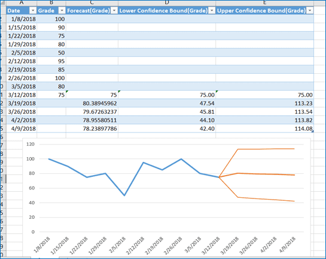

---

> **ВАЖНО**
> 
> Форма для ответов на вопросы будет доступна только при развертывании лабораторной работы 

---

## Задачи

Часть 1: Ввод данных

Часть 2. Выполнение прогноза данных

## Общие сведения и сценарий

Прогнозирование — это способ предсказания значений в будущем на основе данных. Менеджерам нужны данные мгновенно, чтобы принимать решения, и они полагаются на такие методы, как прогнозирование, для принятия этих решений. При работе с большими данными объемы данных создаются мгновенно. Это представляет собой проблему для сбора и обработки этих данных в режиме реального времени.

Эта лабораторная работа очень проста и предназначена для демонстрации того, как выполняется прогнозирование в Microsoft Excel. Вы будете вводить набор еженедельных оценок и использовать функцию прогноза, чтобы увидеть, какие оценки прогнозируются на следующие несколько недель.

## Требуемые ресурсы

Microsoft Excel с установленной опцией Analysis ToolPak или возможностью включения в качестве надстройки (Add-in).

## Инструкции

### Часть 1: Ввод данных
### Шаг 1. Включить надстройку Analysis ToolPak.
1. Откройте пустую таблицу Excel.
2. Нажмите **Файл** и нажмите **Параметры**.
3. Нажмите **Надстройки**. В нижней части страницы выберите **Надстройки Excel** в раскрывающемся списке **Управление**, если это необходимо, и нажмите **Перейти**.
4. В окне надстроек выберите **Analysis ToolPak** and **Solver Add-in** и нажмите **OK**, чтобы продолжить.

Шаг 2. Ввести оценки и даты в определенные ячейки Microsoft Excel.

1. В ячейке A1 введите **Дата**.
2. В ячейке B1 введите **Оценка**.
3. В ячейке C1 введите **Прогноз**.
4. В ячейке D1 введите **Нижняя доверительная граница**.
5. В ячейке E1 введите **Верхняя доверительная граница**.
6. Начиная с ячейки A2, введите следующие даты в ячейки от A2 до A15:
08.01.2018, 15.01.2018, 22.01.2018, 29.01.2018, 05.02.2018, 12.02.2018, 19.02.2018, 26.02.2018, 05.03.2018, 12.03.2018, 19.03.2018, 26.03.2018, 02.04.2018, 09.04.2018

**Примечание**. Формат даты может отличаться в Вашем регионе. В примере для формата даты используется дд/мм/гггг.

**Примечание**. Если в ячейке появляются знаки решетки (###), щелкните левой кнопкой мыши, и, удерживая её нажатой, перетащите линию вправо от дат, чтобы сделать столбец A шире. Или же Вы можете щелкнуть правой кнопкой мыши на A над словом Дата, выбрать **Ширина столбца**, ввести **10** и нажать **ОК**.
7. Начиная с ячейки B2, введите следующие оценки в ячейки от B2 до B11:
100, 90, 75, 80, 50, 95, 85, 100, 80, 75

### Часть 2. Выполнение прогноза данных

В этой части Вы будете использовать Excel, чтобы спрогнозировать Ваши оценки на оставшиеся недели. Помните, что этот прогноз основан на оценках, которые Вы уже получили и ввели в электронную таблицу.

### Шаг 1: Использовать функцию листа прогноза.

1. Выделите ячейки от A2 до A15.
2. На вкладке **Данные** нажмите **Текст по столбцам**, чтобы запустить **мастера распределения текста по столбцам**.
3. На шаге 1 из 3 оставьте значение по умолчанию **С разделителями** и нажмите **Далее**.
4. На шаге 2 из 3 оставьте значение по умолчанию **Знак табуляции** и нажмите **Далее**.
5. На шаге 3 из 3 выберите **Дата** и измените поле в раскрывающемся списке на ДМГ (день/месяц/год). Нажмите **Готово**.
6. Выберите ячейки с A1 по B11.
7. На вкладке **Данные** выберите **Лист прогноза**, чтобы открыть окно **Создать лист прогноза**.
8. В окне календаря **Конец прогноза** выберите 09.04.2018 в качестве даты окончания.
9. Нажмите **Параметры**. Обратите внимание, что Вы можете настроить доверительный интервал. Доверительный интервал — это верхняя и нижняя границы того, что, по прогнозам Excel, Вы наберете в ближайшие несколько недель.
10. Нажмите **Создать**, чтобы создать график и сгенерировать данные прогноза на новом листе. Сгенерированный график должен быть похож на то, что показано ниже. Обратите внимание, что график можно перемещать, если он закрывает какие-либо ячейки данных.

11. Обратите внимание, что Excel прогнозирует, что Вы получите значение 80.39 в поле 19 марта, но на 95% уверен, что это на самом деле будет результат где-то между 47.54 и 113.23.

Вопросы:
- ответьте на вопрос №1
- ответьте на вопрос №2

12. Если вам нравится использовать формулу вместо использования меню, Вы можете ввести формулу и получить те же числа на исходном листе.

В C12 введите следующую формулу:

=ПРЕДСКАЗ.ETS(A12,$B$2:$B$11,$A$2:$A$11,1,1)

В D12 введите следующую формулу:

=C12-ПРЕДСКАЗ.ETS.ДОВИНТЕРВАЛ(A12,$B$2:B$11,$A$2:$A$11,0,95,1,1)

В E12 введите следующую формулу:

=C12+ПРЕДСКАЗ.ETS.ДОВИНТЕРВАЛ(A12,$B$2:B$11,$A$2:$A$11,0,95,1,1)

### Шаг 2: Изменить данные.

1. Измените данные на оценки, которые лучше отражают Ваши собственные оценки.
2. Выделите наборы данных в ячейках от A1 и B1 до A11 и B11.
3. На вкладке **Данные** выберите **Лист прогноза**, чтобы открыть окно **Создать лист прогноза**.
4. Нажмите **Параметры** и измените доверительный интервал с 95% до 98%.

Вопросы:
- ответьте на вопрос №3
- ответьте на вопрос №4