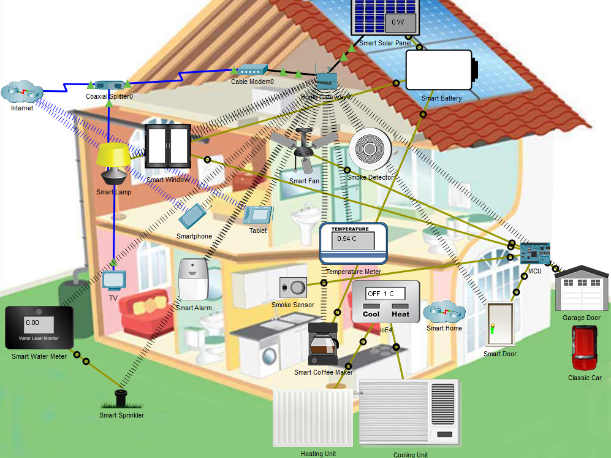
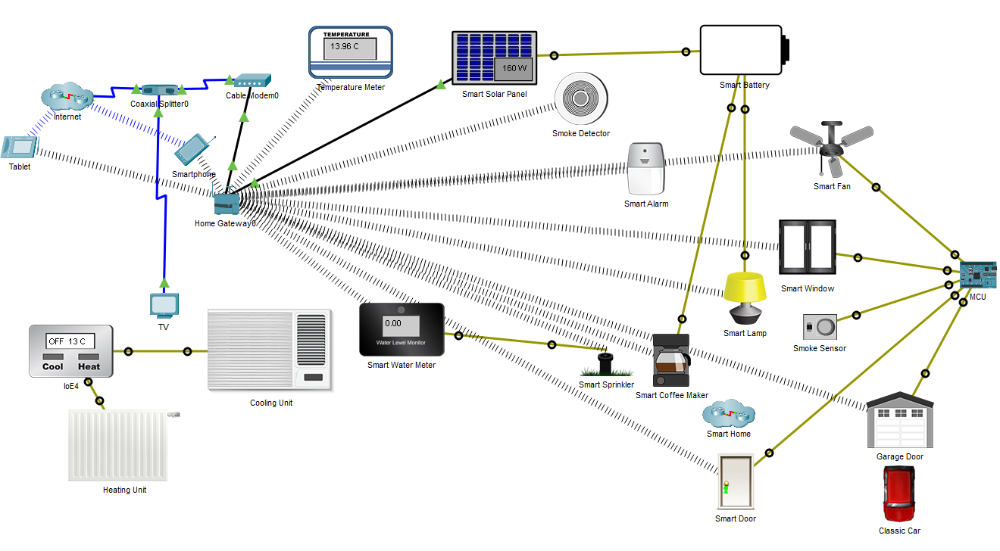

---

> **ВАЖНО**
> 
> Форма для ответов на вопросы будет доступна только при развертывании лабораторной работы 

---

## Топология

<!--  запасная топология - более горизонтальная, но без картинки дома. ОДНАКО, на картинку дома есть отсылки в инструкциях -->

## Цели

Часть 1. Знакомство с умным домом

Часть 2: Граничные вычисления в умном доме

## Общие сведения и сценарий

В этом упражнении Вы изучите пример умного дома. В зависимости от приложения некоторые данные лучше всего обрабатывать рядом с источником. Пример умного дома использует преимущества граничных вычислений для отслеживания уровня дыма, обнаруженного в доме, и принятия соответствующих мер.

## Инструкции

### Часть 1. Знакомство с умным домом
### Шаг 1: Понять устройства, входящий в состав умного дома.

Обычно интернет-провайдеры доставляют данные и видео по одному коаксиальному кабелю. Начиная с чердака, для отделения видеосигнала от сигнала данных используется коаксиальный разветвитель (или сплиттер).

1. Два коаксиальных кабеля выходят из коаксиального разветвителя в показанной топологии.

- Ответьте на вопрос №1
<!-- ТВ и кабельный модем. -->

2. Кабельный модем является интерфейсом между сетью интернет-провайдера и домом.
- Ответьте на вопрос №2
<!-- Коаксиальный разветвитель и домашний шлюз. -->

Домашний шлюз действует как концентратор и маршрутизатор для всех внутренних домашних устройств. Он также предоставляет веб-интерфейс, который позволяет пользователям контролировать и управлять различными устройствами умного дома. Обратите внимание, что домашние устройства могут подключаться к домашнему шлюзу через беспроводное и/или проводное соединение.

**Примечание**. Packet Tracer использует пунктирные лучи для обозначения беспроводных подключений. Однако это может затруднить понимание топологии, если подключено слишком много устройств. Из-за этого беспроводные соединения были скрыты. Чтобы отобразить беспроводные соединения, выберите **Options** > **Preferences** > **Hide Tab** > снимите флажок  с  **Hide Wireless/Cellular Connection** (Скрыть беспроводное/сотовое соединение.

- Ответьте на вопрос №3
<!-- Cable Modem0, smart solar panel, smart window, smart lamp, smart phone, tablet, smoke detector, temperature meter, TV, smart alarm, smart coffee maker, smart door, heating unit, cooling unit, smart water meter, smart sprinkler, микроконтроллер, smart garage door, smoke sensor, and smoke detector. (Кабельный модем0, умная солнечная панель, умное окно, умная лампа, смартфон, планшет, детектор дыма, измеритель температуры, телевизор, умная сигнализация, умная кофеварка, умная дверь, нагревательный блок, охлаждающий блок, умный счетчик воды, умный спринклер, MCU, умная дверь гаража, датчик дыма и детектор дыма). -->

### Шаг 2: Повзаимодействовать с умным домом.
Устройства в умном доме можно контролировать и управлять ими удаленно через любой компьютер в доме. Поскольку все умные устройства подключаются к домашнему шлюзу, на котором размещен веб-интерфейс - планшеты, смартфоны, ноутбуки или компьютеры могут использоваться для взаимодействия с умными устройствами.

1. Щелкните **Tablet**. (Планшет находится на кровати в главной спальне).
2. Перейдите по **Desktop** > **IoT Monitor**.
3. IP-адрес IoT-сервера на домашнем шлюзе — 192.168.25.1. Используйте **admin/admin** в качестве имени пользователя и пароля для входа на домашний шлюз. Нажмите **Login**.

- Ответьте на вопрос №4
<!-- Список всех умных устройств, подключенных в данный момент к домашнему шлюзу. Некоторыми устройствами можно управлять, а за другими можно только наблюдать. -->

4. Умная дверь в настоящее время разблокирована (обозначается зеленым светом на дверной ручке), но ее можно заблокировать удаленно. Щелкните умную дверь в браузере, чтобы развернуть параметр.

5. Нажмите **Lock**, чтобы запереть дверь.

- Ответьте на вопрос №5
<!-- Да. Индикатор дверной ручки стал красным, что в Packet Tracer означает запертую умную дверь. Кроме того, в разделе Smart door в веб-браузере выделена кнопка Lock. -->

6. Нажмите **Unlock**, чтобы открыть дверь.
7. Щелкните детектор дыма в браузере, чтобы развернуть раздел.

- Ответьте на вопрос №6
<!-- Ноль. Детектор в настоящее время не обнаруживает дым.-->
- Ответьте на вопрос №7
<!-- Нет. За детектором дыма можно только наблюдать.-->
8. Умными устройствами также можно управлять напрямую, изображая физическое взаимодействие.
В логической рабочей области (Logical work area) Packet Tracer удерживайте нажатой клавишу ALT и щелкните **Smart Coffee Maker** (Умная кофеварка), чтобы включить или выключить ее.

### Часть 2: Граничные вычисления в умном доме

MCU (Микроконтроллер), добавленный к умному дому, используется для контроля уровня дыма, считываемого датчиком дыма, и принятия решения о том, следует ли проветривать дом. Если уровень угарного газа (CO) поднимается выше 10,3 единиц, MCU запрограммирован на автоматическое открытие окна, входной двери, двери гаража и запуск вентилятора на высокой скорости. Это действие отменяется (закрываются двери и окна и выключается вентилятор), когда уровень CO падает ниже 1 единицы.

### Шаг 1: Запустить классический автомобиль.

Владелец держит классический автомобиль в гараже, и его нужно время от времени запускать. Классический автомобиль вырабатывает угарный газ, который повышает уровень в помещении.

1. Нажмите на **Tablet**, расположенный на кровати в главной спальне.
2. Пройдите  **Desktop** > **Web Browser**.
3. В адресной строке введите **192.168.25.1**. Это IP-адрес домашнего шлюза.
4. Используйте **admin /admin** в качестве имени пользователя и пароля для входа в домашний шлюз.
5. Нажмите **Smoke Detector** (Детектор дыма) в умном доме; оставьте это окно видимым, чтобы Вы могли следить за уровнем дыма.
6. Запустите двигатель автомобиля, зажав клавишу Alt и щелкнув классический автомобиль.

- Ответьте на вопрос №8
<!-- Поскольку двери и окна закрыты, датчик дыма обнаруживает повышенный уровень опасных газов. Когда уровни поднимаются выше 10,3 единиц, MCU действует на это и открывает дверь гаража, входную дверь и окно. MCU также запускает потолочный вентилятор на максимальной скорости. -->

- Ответьте на вопрос №9
<!-- Уровень дыма падает почти до нуля, но не достигает нуля.-->

- Ответьте на вопрос №10
<!-- Нет. Машина все еще работает, и уровень дыма все еще можно измерить.-->

7. Продолжая следить за уровнями, остановите двигатель классической машины, удерживая клавишу Alt и нажимая на классическую машину.

- Ответьте на вопрос №11
<!-- Уровни CO и CO2 падают до 0 единиц-->

- Ответьте на вопрос №12
<!-- Теперь, когда уровни упали ниже 1 единицы, MCU решает, что можно безопасно закрыть дверь гаража, входную дверь и окно. MCU также останавливает вентилятор. -->

## Размышления

Этот пример показывает, что выбор между облачной и граничной обработкой зависит от приложения.

В примере с умным домом наилучшим вариантом были граничные вычисления. Данные, генерируемые датчиками дыма, обрабатывались и использовались для принятия решений относительно качества воздуха в доме. В этом сценарии не было необходимости отправлять данные датчиков в облако для обработки. Облачная обработка замедлит время отклика, что может поставить под угрозу жизнь людей. Другая возможная проблема связана с интернет-связью; если соединение с Интернетом будет потеряно, вся система выйдет из строя, что поставит под угрозу жизни.

[Скачать файл Packet Tracer для локального запуска](./assets/4.1.6-packet-tracer-explore-the-smart-home)
