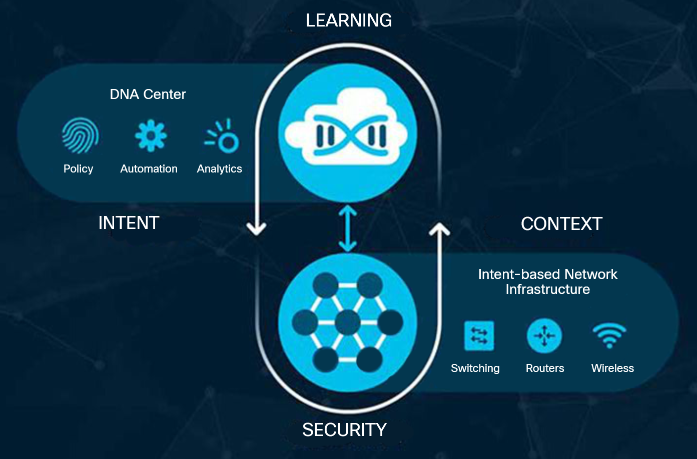
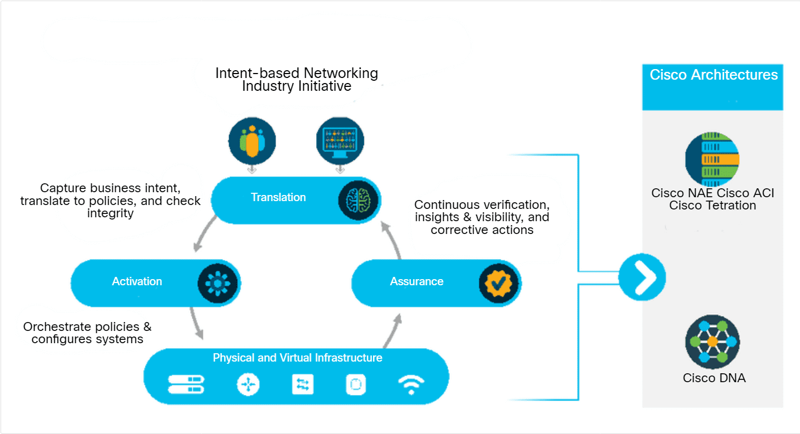

<!-- 4.3.1 -->
## Что такое сеть на основе намерений (IBN)?

Чтобы бизнес мог выжить, он должен быть гибким и быстро реагировать на потребности и требования своих клиентов. Компании все больше зависят от своих цифровых ресурсов для удовлетворения потребностей клиентов, поэтому базовая ИТ-сеть также должна быть достаточно гибкой, чтобы быстро адаптироваться к этим требованиям. Обычно это включает корректировку многих систем и процессов. Эти корректировки могут включать изменения принципов и процедур безопасности, бизнес-служб и приложений, а также принципов деятельности.

В традиционных сетях многие различные компоненты необходимо настраивать вручную, чтобы они соответствовали постоянно меняющимся бизнес-требованиям. Это требует от разных техников и инженеров обеспечения того, чтобы системы были изменены таким образом, чтобы они могли работать вместе для достижения своей цели. Иногда это приводит к ошибкам и задержкам, а часто к неоптимальной производительности сети.

Новая бизнес-сеть должна плавно и безопасно интегрировать IoT-устройства, облачные сервисы и удаленные офисы гибким, быстро реагирующим и соответствующим бизнесу образом. Кроме того, сеть должна защищать эти новые цифровые инициативы от постоянно меняющегося ландшафта угроз.

Чтобы удовлетворить эту потребность, ИТ-индустрия предприняла усилия по созданию системного подхода для привязки управления инфраструктурой к бизнес-целям. Этот подход известен как сеть на основе намерений (или интенционно ориентированная сеть). На рисунке показана общая идея сетей на основе намерений. Благодаря этой новой парадигме потребности бизнеса автоматически и постоянно преобразуются в работу ИТ-инфраструктуры.

<!-- https://dmazqqf7fxgsj.cloudfront.net/netacad-media/graphics/e1d9e0a0-524b-11ec-a117-0f1740ce7119/assets/images/019f61ed-1282-4328-910f-b2025d9e9a44.svg -->

<!-- 4.3.2 -->
## Как связаны ИИ, МО и сети на основе намерений (IBN)?

Сеть на основе намерений использует возможности автоматизации, искусственного интеллекта и машинного обучения для управления функциями сети для достижения определенной цели или намерения.

Сеть на основе намерений позволяет ИТ-команде простым языком указать, что именно они хотят, чтобы сеть выполняла, и сеть делает это возможным. Сеть способна преобразовать намерение в принципы, а затем использовать автоматизацию для развертывания соответствующих конфигураций, необходимых в сети.

Сеть на основе намерений использует ИИ и МО, чтобы гарантировать, что любые развернутые службы соответствуют требуемому уровню обслуживания. Если они не соответствуют уровню обслуживания, сеть на основе намерений может выдавать предупреждения и предлагать улучшения. В некоторых случаях сеть на основе намерений может автоматически переконфигурировать сеть для соответствия уровням обслуживания.

 
Модель сети на основе намерений, показанная на рисунке, состоит из трех ключевых элементов:

**Аналитика**

Элементом аналитики является сквозная проверка поведения в масштабах всей сети. Она прогнозирует результаты любых изменений, отслеживает соответствие первоначальному замыслу и дает рекомендации или корректировки, когда есть несоответствие между намерением и результатом. Этот этап в значительной степени зависит от ИИ и МО. Системы являются частью замкнутого цикла, который постоянно отслеживает производительность и безопасность сети и реконфигурирует сеть для обеспечения соответствия требованиям.

**Трансляция** 

Элемент трансляции — это возможность применять бизнес-цели к конфигурации сети. Намерение — это то, чего Вы хотите достичь, а не то, как это достигается. Это намерение указывается простым языком и используется системой для создания политик в системе. Например, цель может состоять в том, чтобы отделить гостевой трафик от корпоративного трафика или разрешить доступ для удаленных пользователей.

**Активация**

Элемент активации возникает после указания намерения и создания политик. Это когда отдельные устройства подготавливаются для соответствия политикам на основе намерений. Это может быть автоматический или полуавтоматический режим, который позволяет сетевой группе проверить конфигурацию перед развертыванием устройств. Сеть на основе намерений создает гибкую, быстро реагирующую сеть, которая легко масштабируется и адаптируется в соответствии с требованиями бизнеса. Она позволяет эффективно использовать высококвалифицированные ресурсы и позволяет человеку и машине работать вместе для оптимизации обслуживания клиентов. Кроме того, сеть на основе намерений обеспечивает более безопасный цифровой опыт за счет автоматизации трудоемких или сложных процессов. Это значительно упрощает развертывание политик безопасности.

Для получения дополнительной информации и бесплатного обучения работе с сетями на основе намерений посетите [The Cisco Learning Network](https://learningnetwork.cisco.com/s/intent-based-networking-training-videos).

<!-- 4.3.3 -->
## Видео — Примеры использования сетей на основе намерений

Сеть на основе намерений позволяет компаниям сосредоточиться на бизнес-целях. Она представляет собой автоматизированную систему, которая понимает, что нужно организации, и реализует ее. 

Архитектура цифровой сети Cisco (Cisco DNA) является примером сети, основанной на намерениях. Это открытая расширяемая архитектура, управляемая программным обеспечением. Он ускоряет и упрощает операции в корпоративной сети, снижая при этом расходы и риски.

Автоматизация и контроль Cisco DNA основаны на контроллере программно-определяемой сети (SDN), богатой контекстной аналитике, виртуализации сети и безграничной масштабируемости облака.

<!-- ссылка на видео 4.3.3 -->

<!-- 4.3.6 -->
## Размышления
 
Забавно думать о простых вещах, которые можно автоматизировать, например, об игрушке для Вашего кота. И иногда эти шутливые идеи приводят к лучшим идеям, и, как сказано в видео о сети на основе намерений, лучшие идеи могут привести к отличным идеям! Вы также можете подумать о больших идеях автоматизации. Может ли автоматизация помочь очистить планету? Может ли автоматизация помочь ускорить медицинские исследования? Потратьте немного времени, чтобы подумать о том, как Интернет вещей и автоматизация могут улучшить мир для всех.