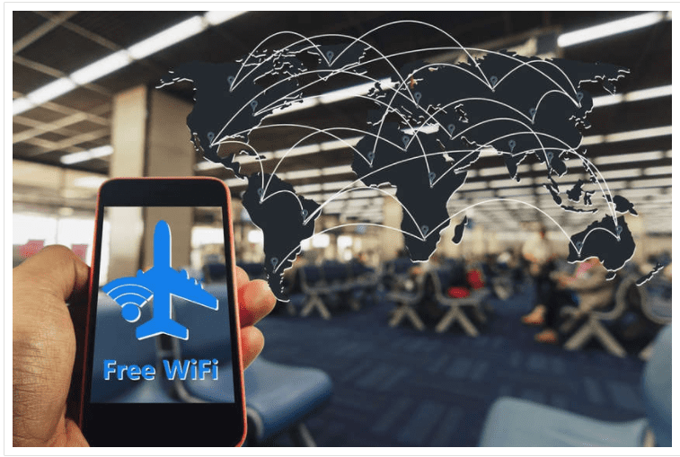

<!-- 5.3.3  -->
## Умные дома

Технология «умный дом» стала очень популярной, и ее популярность растет с каждым годом по мере развития технологии. Кто не находит привлекательным возможность включать или выключать домашний термостат, пока Вы на работе, или иметь холодильник, способный заказывать доставку продуктов к Вашему приходу домой? Разве не круто иметь возможность наблюдать за своей собакой или проверять как Ваши дети делают домашнее задание после школы, активировав домашние камеры безопасности?

По мере того, как мы устанавливаем все больше и больше умных датчиков в наших домах, мы увеличиваем вероятность проблем с безопасностью. Часто датчики подключены к той же сети, что и наши домашние устройства или устройства малого бизнеса, поэтому нарушение работы одного устройства может затрагивать все подключенные устройства. Датчики также могут предоставить хакерам возможность проникнуть в нашу домашнюю сеть и получить доступ к любым ПК и данным, которые к ней подключены.

Даже виртуальные помощники, такие как Apple SIRI, Amazon Echo или Google Home, могут представлять угрозу безопасности. Люди используют эти устройства, чтобы включать музыку, регулировать температуру в помещении, заказывать товары в Интернете и прокладывать маршруты. Может ли это причинить какой-либо вред? Возможна утечка личной информации, такой как пароли или информация о кредитной карте.

К счастью, многие из уязвимостей безопасности первых умных датчиков уже обнаружены. Разработчики работают над исправлением недостатков и улучшением мер безопасности для защиты своих систем от атак. Перед покупкой домашних систем безопасности очень важно изучить информацию о её производителе и протоколах безопасности и шифрования, которые используются для его продуктов.

<!-- 5.3.4  -->
## Публичные точки доступа

Когда Вы находитесь вдали от дома, общедоступная точка доступа Wi-Fi позволяет Вам получить доступ к Вашей онлайн-информации и путешествовать по Интернету. Распространенные действия в общедоступной сети Wi-Fi включают вход в личную учетную запись электронной почты, ввод личной информации, вход в социальные сети и доступ к банковской или финансовой информации. Вся эта информация может быть украдена, если соединение Wi-Fi небезопасно.

Правила безопасности, которым необходимо следовать, если Вы используете общедоступную или незащищенную точку доступа Wi-Fi:

* Не открывайте и не отправляйте конфиденциальную личную информацию через общедоступную беспроводную сеть.
* Уточните, настроен ли на Вашем компьютере доступ к файлам и мультимедиа, и требуется ли для этого авторизация пользователя с шифрованием.
* Используйте зашифрованные туннели и службы виртуальной частной сети (VPN). Служба VPN предоставляет Вам безопасный доступ в Интернет с зашифрованным соединением между Вашим компьютером и VPN-сервером поставщика услуг VPN. При использовании зашифрованного VPN-туннеля даже в случае перехвата передачи данных ее невозможно расшифровать.

Многие мобильные устройства, такие как смартфоны и планшеты, поставляются с беспроводным протоколом Bluetooth. Эта возможность позволяет устройствам с поддержкой Bluetooth подключаться друг к другу и обмениваться информацией. К сожалению, хакеры могут использовать Bluetooth для прослушивания некоторых устройств, а также для установки элементов управления удаленным доступом, распространения вредоносных программ и разрядки аккумуляторов. Чтобы избежать этих проблем, выключайте Bluetooth, когда Вы его не используете.

<!-- 5.3.6  -->
## Размышления
 
Поначалу может показаться разочаровывающим тот факт, что IoT необходимо защищать. Но подумайте об этом так: для людей, работающих в области кибербезопасности, всегда будут доступны рабочие места, а Интернету вещей потребуется столько же, если не больше кибербезопасности, чем большинству сетей. Кто знает, возможно ВЫ станете тем человеком, который найдет лучший способ защитить IoT!