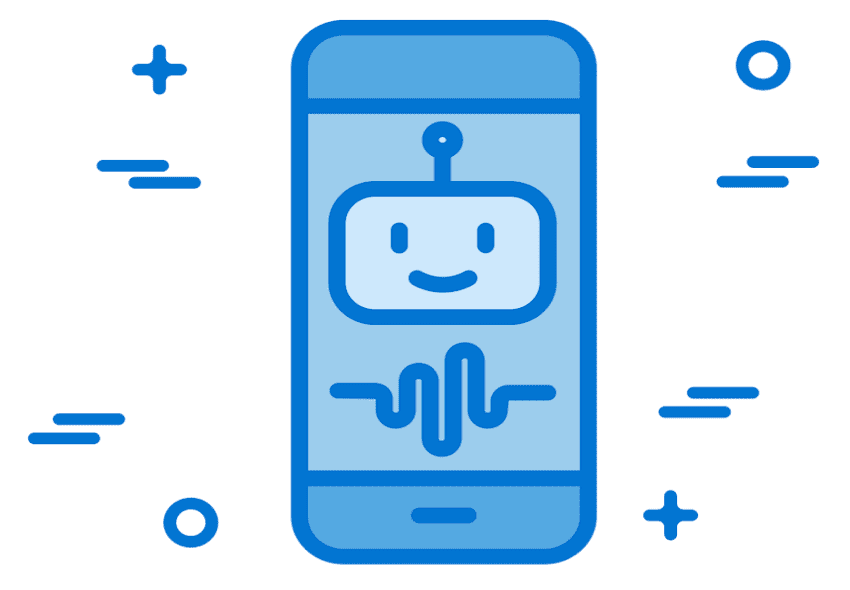

<!-- 6.2.1 -->
##  Сообщества по интересам

Сообщество по интересам — это группа людей, которые разделяют общие интересы или увлечения определенной темой. Эти люди собираются вместе, чтобы поделиться информацией и идеями по этой теме.

Этот общий интерес позволяет группе превратиться в настоящее сообщество. Члены этих сообществ чрезвычайно хорошо осведомлены и увлечены обсуждаемой темой и готовы поделиться своими знаниями с другими членами сообщества. Это делает сообщество отличным ресурсом для развития данной области.

Интернет позволяет этим сообществам существовать виртуально и охватывать несколько географических областей и часовых поясов. Участники могут обмениваться файлами и технологиями в режиме реального времени.

Существует несколько сообществ связанных с Интернетом вещей (IoT). **IEEE** управляет IoT-сообществом, как и **LinkedIn**. Многие другие организации, связанные с технологиями, имеют свои группы по интересам. Сайт и список адресов электронной почты **IoT World Today** являются источником новостей и разработок, связанных с Интернетом вещей. Чтобы лучше понять постоянно развивающийся мир IoT-технологий, подпишитесь на новостной ресурс, посвященный Интернету вещей, чтобы следить за ежедневными событиями.

Некоторые сообщества поддерживаются промышленностью и предоставляют место для помощи в разработке их продуктов и технологий, а также продуктов и технологий их деловых партнеров. Cisco предоставляет два таких сообщества— это **Cisco Learning Network** и **Cisco DevNet**.

**Cisco Learning Network** представляет собой набор ресурсов, информации и форумов для обсуждения. Он предназначен для людей, которые хотят развить свои навыки в различных технологиях Cisco и пройти сертификацию Cisco. Чтобы узнать, что может предложить **Cisco Learning Network**, и стать ее участником, посетите их веб-сайт LearningNetwork.cisco.com.

**DevNet** — это программа для разработчиков от Cisco, которая состоит из веб-сайта, интерактивного сообщества разработчиков, скоординированных инструментов для разработчиков, форумов и изолированных программных сред. Чтобы узнать больше о том, что предлагает **DevNet**, посетите их веб-сайт по адресу developer.cisco.com. Поищите в Интернете, чтобы узнать, как люди используют ресурсы, предоставляемые DevNet, для разработки IoT-технологий.

<!-- 6.2.2 -->
## Отраслевые сертификаты

Отраслевые сертификаты пользуются большим уважением у работодателей во всем мире и помогают подтвердить навыки, необходимые для начала успешной карьеры в области работы с сетями и ИТ. Сертификаты получаются путем сдачи экзамена под контролем удостоверяющего центра. Студенты должны пройти учебные материалы, относящиеся к конкретному сертификационному экзамену. Практический опыт часто очень полезен, но не всегда обязателен для сдачи сертификационного экзамена.

Доступны два основных типа сертификатов: зависящие от поставщика и независимые от поставщика. Сертификаты, зависящие от поставщика, предназначены для технологий, предлагаемых компанией, чтобы доказать, что человек имеет право развертывать и управлять этой технологией. Независимые от поставщика сертификаты предлагаются многими различными организациями. Они показывают, что у человека есть всесторонний набор навыков, основанный на общих системах и программах, а не на конкретных брендах технологий.

Доступны специальные курсы для поставщиков, которые готовят студентов к получению отраслевых сертификатов Cisco. Например, ресурсы по обучению и другим сертификационным материалам доступны в **Cisco Learning Network**.

Ниже перечислены сертификаты Cisco, относящиеся к Интернету вещей:

* **Сеть**. Сертификация **Cisco Certified Network Administrator** (CCNA) проверяет знания и навыки кандидата, связанные с основами сети, доступом к сети, IP-подключением, IP-сервисами, основами безопасности, а также автоматизацией и программируемостью.
* **Безопасность**. Сертификация **Cisco Certified CyberOps Associate** (CBROPS) проверяет навыки и знания в области концепций безопасности, мониторинга безопасности, анализа на основе хоста, анализа сетевых вторжений, а также политик и процедур безопасности.
* **Автоматизация**. Сертификация **Cisco Certified DevNet Associate** (DEVASC) оценивает навыки и знания в области понимания и использования API, платформ и разработки Cisco, разработки приложений и безопасности, а также инфраструктуры и автоматизации.

Чаще всего сертификаты с течением времени необходимо продлевать. Требованиями для повторной сертификации могут быть получение зачётных единиц (CEU), сдача экзамена на повторную сертификацию или и то, и другое. CEU можно заработать, посещая занятия, имея профессиональное членство, приобретая опыт работы или исследуя и публикуя материалы, поддерживающие технологию сертификации.

Чтобы ознакомиться со всеми различными профессиональными сертификатами Cisco, перейдите по ссылке https://www.cisco.com/c/en/us/training-events/training-certifications/certifications.html.

<!-- 6.2.3 -->
## Дополнительные возможности обучения

Сертификаты могут показать работодателю, что человек обладает соответствующими навыками для работы. Дипломы муниципального колледжа или университета могут показать, что человек получил широкие познания в своей области образования. Эти широкие познания создают прочную основу для новых карьерных возможностей в Интернете вещей. Сочетание отраслевых сертификатов и университетских степеней дает студенту наилучшие знания, опыт и образование для продолжения карьеры с большими возможностями и более высокой заработной платой.

При выборе желаемой степени в местном колледже или университете, которая будет относиться к наборам навыков, необходимых для карьеры, связанной с Интернетом вещей, обратите внимание на некоторые из следующих степеней:

* Бизнес-аналитика
* Компьютерные информационные системы
* Компьютерное программирование
* Информатика
* Администрирование баз данных
* Электромеханические устройства автоматики
* Электронная техника
* Работа с сетями под Linux
* Компьютерно-интегрированное производство
* Сетевое администрирование
* Системный анализ
* Администратор веб-сервера

Это не исчерпывающий список. Даже традиционные программы на получение степени, такие как управление цепочками поставок, бизнес и управление проектами, полезны для карьеры в сфере Интернета вещей. Компьютерное проектирование (САПР), черчение, математика и физика применимы и демонстрируют разностороннее образование, которое идеально подходит для карьеры в сфере Интернета вещей.

<!-- 6.2.5 -->
## Размышления 

Не знаю как Вы, а я в восторге! Таких смартфонов, как я, не существовало до 2007 года, а теперь я слышу, что большинство людей не хотели бы прожить без них и дня! Интернет вещей наполнен возможностями, которые мы даже не можем себе представить. Какое изобретение или сервис, созданные благодаря Интернету вещей, мы все будем использовать в повседневной жизни через пять или десять лет?